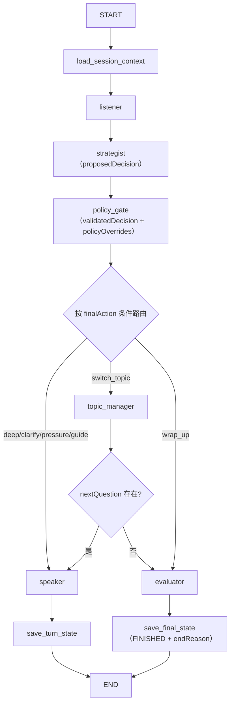

# CareerInvestmentCopilot · 职投 Copilot

AI 求职助手 —— 面向求职全流程的智能 Copilot：简历解析与优化、目标岗位匹配、专业模拟面试（多智能体编排）、真实面试知识库、复盘报告与投递管理。前后端分离：移动端风格 Web 前端 + NestJS 后端（LangGraph 驱动面试决策编排）。

> 本仓库同时包含《LangGraph ↔ NestJS 职责重构》的完整落地成果：面试的“状态机、条件路由、切题与结束判断”已全部移入 LangGraph，NestJS 只负责入口、鉴权、持久化、外部服务适配与事件传输（详见 [plan/重构实施计划.md](plan/重构实施计划.md)）。

---

## 目录

- [功能总览](#功能总览)
- [技术栈](#技术栈)
- [架构：NestJS × LangGraph 职责划分](#架构nestjs--langgraph-职责划分)
- [目录结构](#目录结构)
- [快速开始](#快速开始)
- [环境变量](#环境变量)
- [测试](#测试)
- [API 与文档](#api-与文档)
- [部署](#部署)
- [文档索引](#文档索引)
- [安全说明](#安全说明)

---

## 功能总览

| 模块 | 说明 |
|---|---|
| 简历 | 上传与解析（MinerU）、结构化/优化/定稿（DeepSeek）、JD 匹配分析、PDF 导出（5 套模板） |
| 职位 | 目标岗位管理、基于本地 embedding 的岗位推荐、投递状态与投递漏斗 |
| 模拟面试 | 专业模拟面试（LangGraph 多智能体，SSE 流式）、普通面试、预生成/追加/跳过题目 |
| 复盘报告 | 面试结束后自动生成 AI 版逐题 QA 复盘报告（评分、薄弱点、下一步练习） |
| 面试知识库 | 真实面试录音转录、结构化构建、RAG 检索，用于面试题与追问的上下文增强 |
| 语音 | 实时语音转写（WebSocket 代理本地 ASR 服务）、音频上传转写 |
| 首页 | 求职统计 KPI、每日活动热力图、待办与推荐岗位 |
| 用户 | 注册/登录（JWT）、个人资料与求职模式 |

---

## 技术栈

**前端**（`frontEnd/`）

- React 19 + TypeScript + Vite 6 + Tailwind CSS 4 + Motion
- 移动端优先的组件化页面（登录、工作台、简历优化、岗位匹配、投递管理、面试准备、模拟面试、反馈、复盘、知识库、音频复盘）

**后端**（`ai-job-backend/`）

- NestJS 11 + TypeScript + Prisma 7 + PostgreSQL 16
- `@langchain/langgraph ^1.4.7`：多智能体图编排（条件路由、Checkpoint 评估）
- DeepSeek API（按 Agent 独立模型配置：Listener / Strategist / Speaker / Evaluator）
- SSE 流式输出（专业模拟面试）、WebSocket 实时 ASR 代理
- Swagger（`/api-docs`）、JWT 鉴权、全局异常过滤与请求 ID 中间件

---

## 架构：NestJS × LangGraph 职责划分

专业模拟面试链路是项目的核心亮点：**NestJS 提供“如何接收、调用、存储和传输”；LangGraph 决定“当前处于什么状态、下一步执行什么、何时切题以及何时结束”。**

| 能力 | NestJS | LangGraph |
|---|---|---|
| HTTP / SSE / WebSocket 入口、鉴权、DTO 校验 | ✅ 负责 | — |
| Prisma 访问 | ✅ 经 Repository 实现 | 决定读取与保存时机 |
| Agent 执行顺序、条件路由、深挖/澄清/压力测试/拉回 | — | ✅ 负责 |
| 策略约束（最大轮数、覆盖度、非法动作兜底） | 提供配置 | ✅ Policy Gate 执行并记录覆盖 |
| 题目选择与主题切换 | — | ✅ Topic Manager |
| 结束判断、Evaluator 触发 | 提供模型调用能力 | ✅ 结束分支负责 |
| 会话状态恢复 | 提供持久化能力 | ✅ 以 sessionId 管理状态 |
| 前端事件推送 | 负责传输 | 产生标准化流程事件 |

### 图结构与动作语义



- 六种动作：`continue_deep_dive / clarify / pressure_test / switch_topic / guide_back / wrap_up`。
- `switch_topic` = Topic Manager 选择下一面试节点；`wrap_up` = 进入 Evaluator 结束，二者语义完全不同。
- 策略约束编号 R1-R10（会话结束拒绝生成、最大轮数收尾、覆盖完成收尾、跑偏拉回、连续追问上限切题、无新增事实澄清/切题、非法动作兜底、合规不干预），每次覆盖写入 `policyOverrides[]`。
- 同步提交与流式提交执行**同一张编译图**；Speaker 为模型原生流式（SSE Token 增量）。
- 每个 Agent 节点带独立超时/重试/本地兜底（`with-node-guard`），回退路径写入 `routeTrace` 并发出 `node_fallback` 事件。
- 会话可恢复（Repository 快照 + turnId 幂等），重复提交同一轮不产生重复消息。

> 版本开关：`interviewState.graphVersion = 'v1' | 'v2'`（会话创建时记录）。`v2` 为条件路由图；`v1` 为 legacy 顺序图（功能开关回退，稳定后删除）。新建会话默认版本由 `INTERVIEW_GRAPH_V2_ENABLED` 控制。

---

## 目录结构

```text
CareerInvestmentCopilot/
├── frontEnd/                     # React + Vite 前端
│   ├── src/components/           # 各业务视图（登录/工作台/面试/复盘/知识库…）
│   ├── src/api/                  # 后端 API 客户端（含 SSE 流式）
│   └── server.js                 # 前端静态服务（生产模式）
├── ai-job-backend/               # NestJS + LangGraph + Prisma 后端
│   ├── src/
│   │   ├── auth/ users/          # 鉴权与用户
│   │   ├── resumes/ jobs/        # 简历与职位
│   │   ├── interviews/           # 模拟面试（核心）
│   │   │   ├── graph/            # LangGraph 编排
│   │   │   │   ├── nodes/        # listener/strategist/policy-gate/topic-manager/speaker/evaluator/with-node-guard
│   │   │   │   ├── routes/       # 动作 → 节点映射（条件边路由函数）
│   │   │   │   ├── repositories/ # 会话存储接口 + Prisma 实现
│   │   │   │   └── telemetry/    # 节点计时与决策链遥测
│   │   │   ├── interview-ai.service.ts    # 各 Agent 模型调用（含 Speaker 原生流式）
│   │   │   └── interviews.service.ts      # 入口协调 + 持久化 + 幂等
│   │   ├── interview-knowledge-bases/     # 面试知识库（转录/构建/检索）
│   │   ├── speech/ asr/          # 实时语音转写与音频处理
│   │   ├── reports/ overview/    # 复盘报告与首页统计
│   │   └── common/ prisma/       # 基础设施
│   ├── prisma/                   # Schema 与迁移
│   ├── storage/ public/          # 导出文件与上传资源
│   └── .env.example
├── plan/                         # 重构计划与执行记录
│   ├── langgraph-nestjs-responsibility-migration-plan.md  # 迁移计划
│   └── 重构实施计划.md                                      # 代码级实施计划（含 A-J 执行记录）
└── docs/                         # 业务/接口/数据库/开发手册等文档
```

---

## 快速开始

### 0. 前置依赖

- Node.js 18+（后端建议 20+，`node_modules` 由 npm 安装）
- PostgreSQL 16（可用仓库内 `ai-job-backend/compose.yaml` 一键启动）
- DeepSeek API Key；如需实时语音，另备本地 ASR 服务（见 `ai-job-backend/REALTIME_ASR_SETUP.md`）

### 1. 启动数据库

```bash
cd ai-job-backend
docker compose up -d          # 启动 postgres:16，库名 ai_job，账号 postgres/postgres
```

### 2. 配置后端

```bash
cd ai-job-backend
cp .env.example .env          # 填入 DATABASE_URL、DEEPSEEK_API_KEY、JWT_SECRET 等
npm install
npm run db:seed               # 可选：演示数据（见下）
npm run start:dev             # 开发模式，默认 http://localhost:3000
```

演示账号（`npm run db:seed` 后）：

- 邮箱：`demo@career-copilot.local` / 密码：`Demo@123456`
- 黄金路径：登录 → 简历（已结构化/优化/定稿 + PDF 导出）→ 面试（演示简历 + “第一次面试”知识库生成题目）→ 复盘（AI 版逐题 QA 报告）→ 知识库（真实面试记录）

### 3. 启动前端

```bash
cd frontEnd
npm install
npm run dev:hmr               # Vite 开发服务器，http://localhost:5174
# 或生产形态：npm run dev（先 vite build 再由 server.js 托管）
```

> 后端 CORS 白名单见 `.env` 的 `CORS_ORIGIN`（默认含 5173/5174 与 Android WebView 来源）。

---

## 环境变量

关键变量（完整清单见 `ai-job-backend/.env.example`）：

| 变量 | 说明 |
|---|---|
| `DATABASE_URL` | PostgreSQL 连接串 |
| `JWT_SECRET` | JWT 签名密钥（生产必须替换为随机强密钥） |
| `DEEPSEEK_API_KEY / DEEPSEEK_BASE_URL / DEEPSEEK_MODEL` | DeepSeek 模型与密钥 |
| `INTERVIEW_LISTENER/STRATEGIST/SPEAKER/EVALUATOR_MODEL` | 各 Agent 独立模型 |
| `INTERVIEW_PROFESSIONAL_AI_MODE` | `full` / `fast`（fast 走本地规则节点，便于演示） |
| `INTERVIEW_GRAPH_V2_ENABLED` | 新建专业面试会话默认编排版本（`1` = v2 条件路由图） |
| `INTERVIEW_*_TIMEOUT_MS` / `INTERVIEW_NODE_RETRIES` | 各 Agent 节点超时与重试 |
| `INTERVIEW_EVALUATOR_ASYNC` | `1` 时 Evaluator 移出关键路径（本地评分 + EVALUATING 后台执行） |
| `REALTIME_ASR_*` | 实时语音转写（vivo/Lanxin 网关 + 本地 ASR WebSocket） |
| `AUDIO_UPLOAD_DIR / RESUME_UPLOAD_DIR` | 上传资源目录 |
| `CORS_ORIGIN` | 允许的前端来源（逗号分隔） |

---

## 测试

```bash
cd ai-job-backend
npm test                        # 全量单元测试（jest，rootDir=src）
npm run test:watch
npm run test:cov                # 覆盖率
npm run lint                    # ESLint（--fix）
npm run build                   # nest build
```

面试模块测试覆盖（83 条）：六种动作路由矩阵、策略约束 R1-R10、Topic Manager 选题、同步/流式一致性、四类 Agent 失败回退、超时与重试、Repository 幂等、重复提交拦截、Telemetry 聚合等——全部使用节点桩/内存仓库，**不依赖真实 LLM 与数据库**。

前端类型检查：`cd frontEnd && npm run lint`（`tsc --noEmit`）。

---

## API 与文档

- 交互式接口文档：启动后端后访问 `http://localhost:3000/api-docs`（Swagger，Bearer 鉴权）。
- 专业模拟面试流式端点：`POST /interviews/sessions/:sessionId/answer/stream`（SSE）。
- 标准流程事件：`thinking_start / listener_done / strategist_done / policy_checked / route_selected / topic_switched / speaker_delta / speaker_done / turn_saved / evaluation_done / interview_finished / node_fallback`，配合 `session` 事件返回最终会话。
- 详细接口约定见 `docs/api规范.md` 与 `docs/log/前后端接口.md`。

---

## 部署

- 后端：`npm run build` 后 `npm run start:prod`（`node dist/src/main`）。
- 前端：`npm run build` 产出静态资源，由 `server.js` 托管；Android WebView / Capacitor 打包清单见 `capacitor-apk-info-checklist.md`。
- 仓库提供 `.github/workflows/deploy.yml` 与 `ai-job-backend/ali-nginx.conf`（阿里云 Nginx 反代示例）。
- 上线建议：先以 `INTERVIEW_GRAPH_V2_ENABLED=0` 灰度，对比 v1/v2 日志与指标后切到 `1`；回滚只影响新建会话。

---

## 文档索引

| 文档 | 内容 |
|---|---|
| `plan/langgraph-nestjs-responsibility-migration-plan.md` | LangGraph × NestJS 职责重构迁移计划 |
| `plan/重构实施计划.md` | 代码级实施计划 + Step 0-10 执行记录（附录 A-J） |
| `docs/模拟面试管线与提示词说明.md` | 面试管线与各 Agent 提示词 |
| `docs/知识库构建文档.md` / `docs/当前后端数据库说明.md` | 知识库与数据库说明 |
| `docs/开发手册.md` / `docs/本地开发+gitAction+服务器刷新.md` | 开发与发布手册 |
| `ai-job-backend/BACKEND_PROGRESS.md` | 后端活文档 |
| `ai-job-backend/REALTIME_ASR_SETUP.md` | 实时语音转写环境搭建 |

---

## 安全说明

- 真实 `.env`、API Key、依赖目录（`node_modules`）与构建产物（`dist` 等）不提交仓库。
- 请根据各子项目 `.env.example` 配置环境变量；生产密钥应通过密钥管理服务或容器 Secret 注入。
- 不要将密钥写入文档、截图、日志或提交记录。
