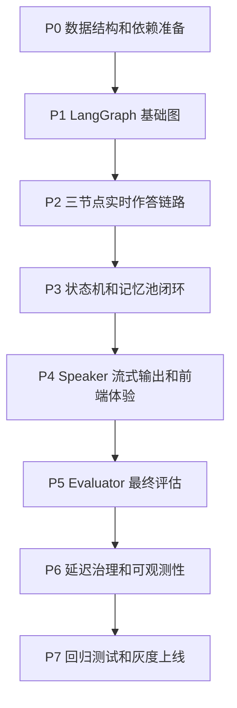
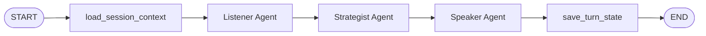
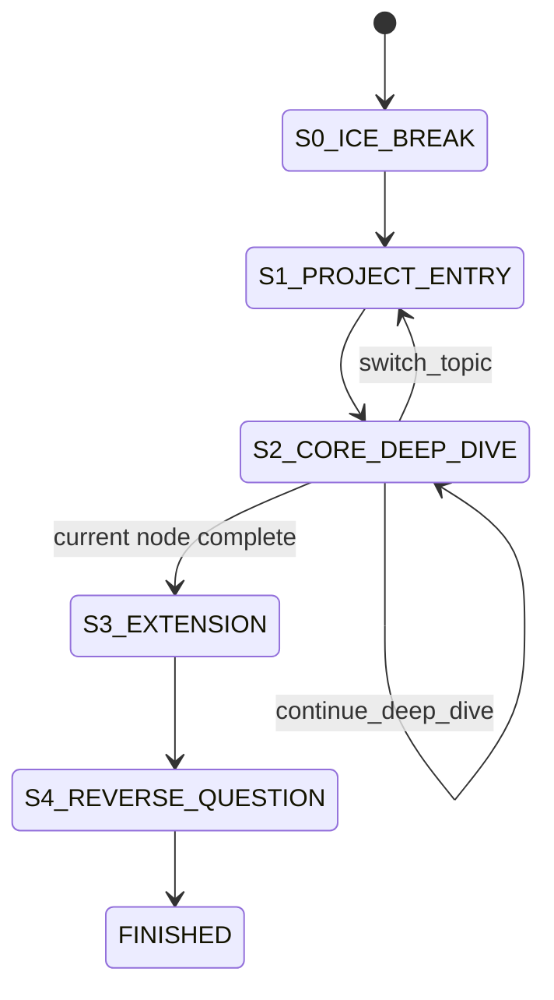

# 专业模拟面试模式执行计划

本文基于 `专业模拟面试模式落地方案.md`，将 LangGraph 四 Agent 专业模拟面试拆解为可执行开发计划。目标是在不破坏现有普通模拟面试能力的前提下，逐步上线专业模式的新管线。

## 1. 实施目标

本次执行计划要交付以下能力：

1. 使用 LangGraph 编排专业模拟面试流程。
2. 固定四个 Agent：
   - Listener Agent：听懂候选人回答。
   - Strategist Agent：下达下一步面试决策。
   - Speaker Agent：输出真实面试口吻，支持流式输出。
   - Evaluator Agent：面试结束后做最终总结评估。
3. 将现有 `generateFollowUpQuestion` 升级为 `InterviewGraphService.runTurn`。
4. 通过 `interviewState`、`memoryState`、`evaluationState` 支持状态机、记忆池和最终评估。
5. 第一版必须内置延迟治理：
   - Listener + Strategist 可合并。
   - Listener / Strategist 使用快模型。
   - Speaker 使用更强模型和流式输出。
   - 前端显示“思考中”。
   - Strategist 只读结构化摘要，不读全量历史。
   - Speaker 只读最近 3 轮原始对话 + Strategist 指令。

## 2. 总体交付路径



## 3. P0：数据结构和依赖准备

### 目标

为 LangGraph 管线准备依赖、数据库字段和类型定义。

### 后端任务

1. 安装依赖：

```bash
npm install @langchain/langgraph @langchain/core
```

2. Prisma 增加字段：

```prisma
model InterviewSession {
  // existing fields...
  interviewState   Json?
  memoryState      Json?
  evaluationState  Json?
}
```

3. 新增 migration。

4. 新增类型文件：

```text
src/interviews/graph/interview-graph.state.ts
```

核心类型：

```ts
export type InterviewStage =
  | 'S0_ICE_BREAK'
  | 'S1_PROJECT_ENTRY'
  | 'S2_CORE_DEEP_DIVE'
  | 'S3_EXTENSION'
  | 'S4_REVERSE_QUESTION'
  | 'FINISHED';

export type InterviewGraphState = {
  sessionId: string;
  userId: number;
  stage: InterviewStage;
  latestAnswer: string;
  recentRawMessages: Array<{ role: 'assistant' | 'user'; content: string }>;
  turnSummaries: Array<{
    turn: number;
    topic: string;
    facts: string[];
    missingSlots: string[];
    riskSignals: string[];
  }>;
  strategySnapshot: unknown;
  memoryState: unknown;
  listenerOutput?: unknown;
  strategistDecision?: unknown;
  speakerOutput?: unknown;
  evaluationState?: unknown;
};
```

### 验收标准

- `npm run build` 通过。
- Prisma migration 可执行。
- 旧模拟面试 session 不受影响。
- 老数据缺少三个 JSON 字段时，后端读取有默认值。

## 4. P1：LangGraph 基础图

### 目标

新增 `InterviewGraphService`，完成 LangGraph StateGraph 的基本编排骨架。

### 新增目录

```text
src/interviews/graph/
  interview-graph.service.ts
  interview-graph.state.ts
  nodes/listener.node.ts
  nodes/strategist.node.ts
  nodes/speaker.node.ts
  nodes/evaluator.node.ts
  prompts/listener.prompt.ts
  prompts/strategist.prompt.ts
  prompts/speaker.prompt.ts
  prompts/evaluator.prompt.ts
```

### Graph 骨架



### 后端任务

1. 创建 `InterviewGraphService.runTurn`。
2. 创建 `InterviewGraphService.runFinalEvaluation`。
3. 创建 `loadSessionContext`，将数据库 session 转换为 `InterviewGraphState`。
4. 创建 `saveTurnState`，将 state patch 写回：
   - `messages`
   - `interviewState`
   - `memoryState`
   - `evaluationState`
5. 在 `InterviewsModule` 注入 `InterviewGraphService`。

### 验收标准

- 可以在单元测试中调用 `runTurn`。
- Graph 节点可以用 mock 输出跑通。
- 不调用真实 LLM 时也能本地 fallback。

## 5. P2：三节点实时作答链路

### 目标

先上线实时链路中的三个节点：Listener、Strategist、Speaker。Evaluator 留到结束阶段。

### 5.1 Listener Agent

职责：

- 抽取候选人回答中的事实。
- 识别 STAR 槽位。
- 标记缺失信息和风险信号。
- 生成 `turnSummary`。

输入：

- 当前问题。
- 用户最新回答。
- 最近 3 轮原始对话。
- `turnSummaries`。
- `memoryState`。
- 简历节点和 JD 能力标签。

输出：

```json
{
  "summary": "候选人说明用 SARIMAX 预测销量，但没有给出评估指标。",
  "entities": ["SARIMAX", "外生变量", "MAPE", "RMSE"],
  "facts": ["使用 SARIMAX 做时间序列预测"],
  "missingSlots": ["外生变量选择依据", "MAPE/RMSE 提升幅度"],
  "riskSignals": ["指标不明确", "个人贡献边界不清"]
}
```

### 5.2 Strategist Agent

职责：

- 读取 Listener 输出。
- 结合 `interviewState`、`memoryState`、`strategySnapshot` 决策下一步。
- 输出 action、nextState、speakerInstruction。

动作集合：

```text
continue_deep_dive
clarify
pressure_test
switch_topic
guide_back
wrap_up
```

输出：

```json
{
  "action": "continue_deep_dive",
  "nextState": "S2_CORE_DEEP_DIVE",
  "targetCapability": "建模评估与实验设计",
  "targetResumeNode": "全国大学生数学建模大赛",
  "reason": "候选人提到模型优化，但缺少外生变量选择依据和指标提升幅度。",
  "speakerInstruction": "围绕外生变量选择和 MAPE/RMSE 提升幅度追问，只问一个问题。",
  "memoryPatch": [
    "候选人使用 SARIMAX 做销量预测",
    "候选人尚未说明 MAPE/RMSE 的具体提升"
  ]
}
```

### 5.3 Speaker Agent

职责：

- 把 Strategist 指令转成真实面试官口吻。
- 每次只问一个核心问题。
- 不评分，不总结优缺点。
- 支持流式输出。

输入：

- `speakerInstruction`
- 用户最新回答
- 最近 3 轮原始对话
- 当前 JD/简历必要上下文

输出：

```json
{
  "messageType": "follow_up",
  "content": "你刚才提到 SARIMAX 引入外生变量后效果变好，我想具体问一下：这些外生变量是怎么选出来的？你当时用 MAPE 或 RMSE 看到的提升大概是多少？"
}
```

### 服务改造

修改：

```text
InterviewsService.submitAnswer
```

从：

```text
保存回答 -> createFollowUpQuestionMessage -> 保存 messages
```

改为：

```text
保存回答 -> InterviewGraphService.runTurn -> 保存 assistant message 和状态补丁
```

### 验收标准

- 专业模式提交回答后走 LangGraph。
- 非专业模式保持现有逻辑。
- Listener、Strategist、Speaker 的输出可在日志中定位。
- 每轮 assistant 只输出一个核心问题。

## 6. P3：状态机和记忆池闭环

### 目标

让专业模式具备面试节奏，不再无上限追问。

### 状态流转



### 规则

- 单个项目节点最多连续深挖 2 到 3 轮。
- 如果候选人连续两轮没有补充新事实，Strategist 应切换问题或进行澄清。
- 如果用户跑偏，Strategist 输出 `guide_back`。
- 如果核心能力覆盖完成，Strategist 输出 `wrap_up`。

### 记忆池更新

每轮写入：

- `candidateClaims`
- `verifiedEvidence`
- `unverifiedClaims`
- `resumeNodes[].askedIntents`
- `resumeNodes[].missingIntents`
- `turnSummaries`

### 验收标准

- 同一节点不会无限追问。
- 第 10 轮时 Strategist 不读取全量对话。
- `turnSummaries` 能覆盖主要追问链路。
- `memoryState` 能解释下一轮为什么这么问。

## 7. P4：Speaker 流式输出和前端体验

### 目标

降低多 Agent 串行调用带来的等待感。

### 后端任务

1. Speaker Agent 支持 streaming。
2. 新增流式接口或复用现有聊天接口扩展：

```text
POST /interviews/sessions/:sessionId/answer/stream
```

3. 流式事件建议：

```text
thinking_start
listener_done
strategist_done
speaker_delta
speaker_done
turn_saved
error
```

### 前端任务

1. 用户提交后立即显示：

```text
面试官正在梳理你的回答...
```

2. Speaker 开始输出后，切换为流式气泡。
3. `messageType = pressure_test` 时显示「压力追问」标签。
4. `messageType = topic_switch` 时显示「切换方向」标签。
5. 保留“换个方向”“跳过”“提示我怎么答”等控制按钮。

### 验收标准

- 用户提交后 300ms 内出现等待态。
- Speaker 首 token 返回后前端开始增量展示。
- 断流或报错时可以回落到普通非流式接口。

## 8. P5：Evaluator 最终评估

### 目标

Evaluator 只在面试结束后运行，负责最终总结评估。

### 触发点

```text
POST /interviews/sessions/:sessionId/end
```

或报告生成时：

```text
POST /reports
```

### 输入

- `turnSummaries`
- `strategistDecisionLog`
- `memoryState`
- `strategySnapshot`
- 必要的最近原文片段
- JD 和简历能力树

### 输出

```json
{
  "overallScore": 78,
  "dimensionScores": {
    "technicalDepth": 75,
    "logic": 80,
    "jdFit": 76,
    "evidenceDensity": 68,
    "communication": 82
  },
  "verifiedStrengths": ["能解释建模流程", "能说明项目背景"],
  "unverifiedClaims": ["模型效果提升幅度", "个人贡献边界"],
  "followUpChainReview": [
    {
      "topic": "数学建模项目",
      "chain": ["为什么选择 SARIMAX", "外生变量如何选择", "MAPE/RMSE 提升多少"],
      "result": "能说明方案，但缺少指标证据"
    }
  ],
  "nextPracticeActions": ["补齐项目指标", "练习个人贡献边界表达"]
}
```

### 报告页面增强

新增模块：

- JD 能力覆盖情况。
- 追问链路复盘。
- 已验证亮点。
- 未验证声称。
- 下一轮练习动作。

### 2026-07-03 执行状态

已完成后端落地：

- `InterviewAiService.runEvaluator` 已补齐 Evaluator Agent 的真实 LLM 调用入口。
- `InterviewGraphService.runFinalEvaluation` 已改为 AI 优先、本地 evaluator 兜底。
- `POST /interviews/sessions/:sessionId/end` 已在专业模式下触发最终评估，并持久化 `evaluationState`。
- `ReportsService.generate` 已读取 `evaluationState`，AI 报告和本地兜底报告都会参考最终评估结果。
- 已新增单测覆盖最终评估图节点和结束面试持久化链路。

### 验收标准

- 面试过程中 Evaluator 不打断用户。
- 结束后报告能解释每条主要追问链路。
- 报告能区分“已验证事实”和“未验证声称”。

## 9. P6：延迟治理和可观测性

### 目标

让多 Agent 可上线、可调试、可降级。

### 9.1 Listener + Strategist 合并

新增合并节点：

```text
nodes/listener-strategist.node.ts
```

启用条件：

- 用户回答短。
- 当前不是核心深挖节点。
- 系统检测到模型响应变慢。
- 配置开关开启低延迟模式。

合并节点输出必须仍保留：

- `listener`
- `strategist`

方便调试。

### 9.2 快慢模型配置

新增环境变量：

```text
INTERVIEW_LISTENER_MODEL=deepseekV4-flash
INTERVIEW_STRATEGIST_MODEL=deepseekV4-flash
INTERVIEW_SPEAKER_MODEL=deepseek-v4-pro
INTERVIEW_EVALUATOR_MODEL=deepseek-v4-pro
INTERVIEW_ENABLE_STREAMING=true
INTERVIEW_ENABLE_FAST_PATH=true
```

### 9.3 Token 控制

必须实现：

- `turnSummaries` 替代全量历史。
- `recentRawMessages` 最多保留最近 3 轮。
- Strategist 不读取全量 `messages`。
- Speaker 不读取全量 `messages`。
- Evaluator 默认读取摘要，必要时再读取原文片段。

### 9.4 Trace 日志

每个 node 记录：

```json
{
  "sessionId": "xxx",
  "node": "strategist",
  "durationMs": 820,
  "inputTokensEstimate": 1200,
  "outputTokensEstimate": 260,
  "action": "continue_deep_dive",
  "fallback": false
}
```

### 验收标准

- 第 10 轮对话时响应时间没有成倍增长。
- trace 能定位 Listener、Strategist、Speaker 哪个节点慢或错。
- 快路径开启后减少一次 LLM 调用。

## 10. P7：测试、灰度和回滚

### 单元测试

覆盖：

- `listener.node`
- `strategist.node`
- `speaker.node`
- `evaluator.node`
- `interview-graph.service`
- `InterviewsService.submitAnswer`

### 集成测试

场景：

1. 专业模式完整跑 5 轮。
2. 候选人回答很短，触发 clarify。
3. 候选人跑偏，触发 guide_back。
4. 单个项目追问 3 轮后切题。
5. 结束面试后触发 Evaluator。
6. 第 10 轮只传摘要和最近 3 轮原文。

### 前端测试

场景：

- 提交回答后显示“思考中”。
- Speaker 流式输出正常。
- 流式失败回落非流式。
- 标签显示：压力追问、切换方向、反问环节。

### 灰度策略

新增配置：

```text
INTERVIEW_PROFESSIONAL_GRAPH_ENABLED=false
```

上线顺序：

1. 本地开发环境启用。
2. 测试账号启用。
3. 专业模式启用，其他模式不启用。
4. 观察 trace、错误率、平均响应时间。
5. 稳定后扩大到全部用户。

### 回滚策略

当出现以下情况时回滚到旧逻辑：

- LangGraph node 连续失败。
- Speaker 超时。
- JSON 输出无法解析。
- 平均响应时间超过阈值。

回滚方式：

```text
INTERVIEW_PROFESSIONAL_GRAPH_ENABLED=false
```

## 11. 任务清单

| 阶段 | 任务 | 产物 | 验收 |
| --- | --- | --- | --- |
| P0 | 安装依赖、增加 Prisma 字段、定义 State 类型 | migration、state.ts | build 通过 |
| P1 | 创建 LangGraph 编排服务 | InterviewGraphService | mock graph 跑通 |
| P2 | 实现 Listener/Strategist/Speaker | 三个 node 和 prompt | 专业模式可追问 |
| P3 | 接入状态机和记忆池 | interviewState、memoryState | 不无限追问 |
| P4 | Speaker 流式输出 | stream API、前端流式气泡 | 有思考中和 streaming |
| P5 | Evaluator 最终评估 | evaluationState、报告增强 | 结束后生成评估 |
| P6 | 延迟优化和 trace | fast path、模型配置、trace log | 第 10 轮不明显变慢 |
| P7 | 测试灰度回滚 | 测试用例、开关 | 可灰度、可回滚 |

## 12. 推荐开发顺序

推荐按以下顺序执行：

1. P0 + P1：先让 LangGraph 骨架跑起来。
2. P2：先做非流式三节点链路，保证真实追问质量。
3. P3：补状态机和记忆池，解决节奏控制。
4. P4：再做 Speaker streaming，优化体感。
5. P5：最后接 Evaluator，增强报告。
6. P6 + P7：上线前统一做延迟治理、trace、灰度和回滚。

不要一开始就同时做 streaming、Evaluator、trace 和复杂降级。先保证专业模式的核心对话闭环可靠，再逐层增强。
