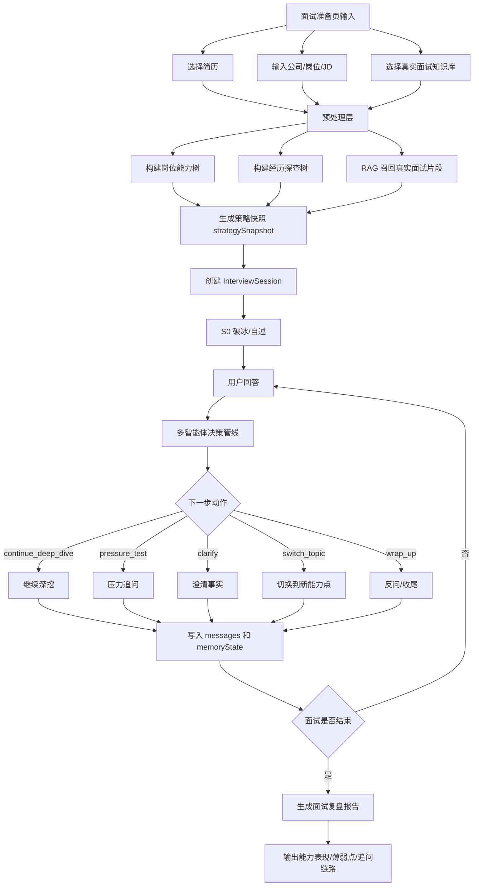
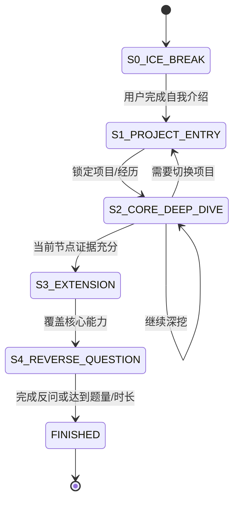
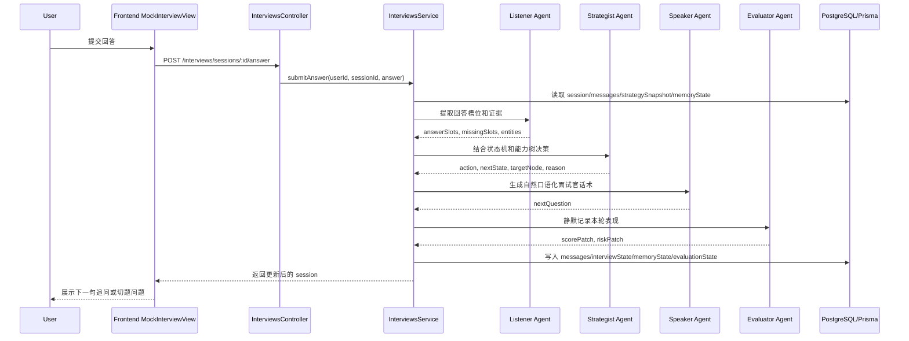

# 专业模拟面试模式落地方案

本文基于 `专业模拟面试模式.md`，将“状态机驱动 + 多智能体协同 + 动态深挖”的设想拆成可在当前项目中落地的工程方案。目标不是把模拟面试做成静态题库问答，而是让 AI 面试官能根据候选人的上一轮回答持续判断：继续深挖、切换话题、纠偏、施压，还是进入收尾。

## 1. 落地目标

专业模拟面试模式要解决三个问题：

1. 追问要贴着候选人的回答走，而不是从题库里机械抽题。
2. 面试要有节奏控制，避免一直追问一个点，也避免过早跳题。
3. 复盘报告要能解释“为什么这样追问”，而不仅是给最终分数。

当前项目已经具备以下基础能力：

- 创建面试会话时加载简历、JD、知识库，并生成 `questions` 和 `strategySnapshot`。
- 用户提交回答后，后端可以调用 AI 生成追问。
- 面试结束后可生成结构化报告。
- `InterviewSession` 已有 `messages`、`questionFeedback`、`strategySnapshot` 等 JSON 字段，适合继续扩展状态数据。

需要补齐的核心能力：

- 将 `generateFollowUpQuestion` 升级为 `decideNextInterviewMove`。
- 在 session 中维护 `interviewState` 和 `memoryState`。
- 将单次追问拆成 Listener、Strategist、Speaker、Evaluator 的协同管线。

## 2. 总体管线



## 3. 状态机设计

专业模式建议采用轻量有限状态机，不需要引入复杂工作流引擎。状态直接保存在 `InterviewSession.interviewState` 中即可。



状态含义：

| 状态 | 作用 | 典型问题 |
| --- | --- | --- |
| `S0_ICE_BREAK` | 破冰和自我介绍 | “请用 1 分钟介绍你和这个岗位最相关的经历。” |
| `S1_PROJECT_ENTRY` | 选择一个项目或实习经历切入 | “你刚才提到数据分析实习，这里面你具体负责哪一块？” |
| `S2_CORE_DEEP_DIVE` | 对技术方案、业务背景、指标、个人贡献深挖 | “SARIMAX 外生变量具体选了哪些？怎么验证有效？” |
| `S3_EXTENSION` | 从项目延展到岗位能力、行业认知、反事实场景 | “如果数据量扩大 10 倍，你会怎么改方案？” |
| `S4_REVERSE_QUESTION` | 候选人反问和求职动机验证 | “你有什么想了解团队或岗位的地方？” |
| `FINISHED` | 结束并触发报告 | 生成复盘报告 |

## 4. 多智能体协同管线

多智能体不建议一开始拆成多个独立微服务。第一版可以在 `InterviewAiService` 内实现为多个 Prompt 方法，必要时合并为一次 JSON 输出，降低延迟和调用成本。



### 4.1 Listener Agent

职责：只理解候选人回答，不负责提问。

输入：

- 当前问题
- 用户最新回答
- 最近 6 到 8 条消息
- 简历片段、JD 能力标签、当前项目节点

输出建议：

```json
{
  "summary": "候选人说明用 SARIMAX 预测销售量，并引入外生变量改善准确率。",
  "entities": ["SARIMAX", "外生变量", "MAPE", "RMSE"],
  "slots": {
    "background": "商场定价和销量预测",
    "action": "引入外生变量并做时间序列建模",
    "result": "提到精度提升，但缺少具体数值",
    "personalContribution": "不明确"
  },
  "missingSlots": ["外生变量选择依据", "评估指标数值", "个人贡献边界"],
  "riskSignals": ["指标泛化", "贡献不清"]
}
```

### 4.2 Strategist Agent

职责：决定下一步动作，不直接写最终话术。

可选动作：

| action | 含义 | 使用场景 |
| --- | --- | --- |
| `continue_deep_dive` | 继续深挖 | 回答里出现可验证技术点或模糊指标 |
| `clarify` | 澄清事实 | 候选人描述不完整，缺背景/角色/结果 |
| `pressure_test` | 压力测试 | 回答看似完整，需要验证边界、反事实、取舍 |
| `switch_topic` | 切换话题 | 当前节点已充分，或追问次数达到上限 |
| `guide_back` | 拉回主题 | 用户跑偏、绕开 JD 核心要求 |
| `wrap_up` | 收尾 | 核心能力覆盖完成或达到题量/时间 |

输出建议：

```json
{
  "action": "continue_deep_dive",
  "nextState": "S2_CORE_DEEP_DIVE",
  "targetCapability": "建模评估与实验设计",
  "targetResumeNode": "全国大学生数学建模大赛",
  "reason": "候选人提到模型优化，但没有说明外生变量选择和指标提升幅度。",
  "questionIntent": "验证方案是否真实落地，以及候选人是否理解评估指标。",
  "memoryPatch": [
    "候选人使用 SARIMAX 做销量预测",
    "候选人尚未说明 MAPE/RMSE 的具体提升"
  ]
}
```

### 4.3 Speaker Agent

职责：把决策转成自然面试官话术。

话术要求：

- 每次只问一个核心问题。
- 口吻像技术探讨，不像审问。
- 必须引用用户上一轮回答中的关键词。
- 不给评分，不总结优缺点，不提前泄露评估标准。

输出示例：

```json
{
  "messageType": "follow_up",
  "content": "你刚才提到 SARIMAX 引入外生变量后预测效果变好，我想具体问一下：这些外生变量是怎么选出来的？你当时用 MAPE 或 RMSE 看到的提升大概是多少？"
}
```

### 4.4 Evaluator Agent

职责：后台静默评估，不干扰对话。

记录维度：

- 技术深度
- 逻辑自洽
- 岗位匹配
- 证据密度
- 表达结构
- 抗压表现
- 跑题风险

输出写入 `evaluationState`，最终给报告服务使用。

## 5. 推荐数据结构

建议在 `InterviewSession` 增加三个 JSON 字段：

```prisma
model InterviewSession {
  // existing fields...
  interviewState Json?
  memoryState    Json?
  evaluationState Json?
}
```

`interviewState` 示例：

```json
{
  "stage": "S2_CORE_DEEP_DIVE",
  "currentResumeNodeId": "project-math-modeling",
  "currentCapability": "建模评估与实验设计",
  "turnCount": 5,
  "deepDiveCountForCurrentNode": 2,
  "coveredCapabilities": ["自我介绍", "项目背景", "技术方案"],
  "pendingCapabilities": ["量化结果", "个人贡献", "反事实推演"],
  "lastAction": "continue_deep_dive"
}
```

`memoryState` 示例：

```json
{
  "candidateClaims": [
    "使用 SARIMAX 预测商场销量",
    "通过外生变量提升预测准确率"
  ],
  "verifiedEvidence": [
    "能解释项目背景和基本建模流程"
  ],
  "unverifiedClaims": [
    "准确率大幅提升",
    "外生变量选择合理"
  ],
  "resumeNodes": [
    {
      "id": "project-math-modeling",
      "title": "全国大学生数学建模大赛",
      "status": "probing",
      "askedIntents": ["背景", "方案"],
      "missingIntents": ["指标", "贡献边界", "失败复盘"]
    }
  ]
}
```

`evaluationState` 示例：

```json
{
  "dimensionScores": {
    "technicalDepth": 65,
    "logic": 70,
    "jdFit": 60,
    "evidenceDensity": 45,
    "communication": 72
  },
  "turnReviews": [
    {
      "questionId": "q-1",
      "action": "continue_deep_dive",
      "riskSignals": ["缺少指标"],
      "positiveSignals": ["能说明技术路线"]
    }
  ]
}
```

## 6. 后端改造点

### 6.1 `InterviewAiService`

新增方法：

```ts
decideNextInterviewMove(input: DecideNextInterviewMoveInput): Promise<InterviewMoveDecision>
```

建议返回：

```ts
type InterviewMoveDecision = {
  action: 'continue_deep_dive' | 'clarify' | 'pressure_test' | 'switch_topic' | 'guide_back' | 'wrap_up';
  nextState: 'S0_ICE_BREAK' | 'S1_PROJECT_ENTRY' | 'S2_CORE_DEEP_DIVE' | 'S3_EXTENSION' | 'S4_REVERSE_QUESTION' | 'FINISHED';
  messageType: 'question' | 'follow_up' | 'pressure_test' | 'topic_switch' | 'closing';
  content: string;
  reason: string;
  memoryPatch: string[];
  evaluationPatch: {
    positiveSignals: string[];
    riskSignals: string[];
    dimensionScores?: Record<string, number>;
  };
};
```

第一版可以用一个 Prompt 同时完成 Listener、Strategist、Speaker、Evaluator 的结构化输出。等效果稳定后，再拆成多个 LLM 调用。

### 6.2 `InterviewsService.submitAnswer`

当前逻辑：

```text
保存用户回答 -> 生成 followUpMessage -> 保存 messages
```

目标逻辑：

```text
保存用户回答
读取 questions / strategySnapshot / interviewState / memoryState / evaluationState
调用 decideNextInterviewMove
根据 action 决定是否更新 currentQuestion / ended / stage
写入 assistant message
合并 memoryPatch / evaluationPatch
保存 session
返回 session
```

### 6.3 `moveToNextQuestion`

专业模式下不建议让前端直接强制进入下一题。可以保留接口，但增加规则：

- 普通模式：沿用当前手动下一题。
- 专业模式：优先由 `decideNextInterviewMove` 判断是否切题。
- 用户点击“跳过/下一题”时，后端把它视为 `manual_switch_topic` 信号，写入 `interviewState.lastUserControlAction`。

### 6.4 报告生成

报告服务应读取 `evaluationState` 和 `memoryState`，补充以下内容：

- 本轮面试覆盖了哪些 JD 能力。
- 哪些简历亮点被验证了，哪些仍然只是口头声称。
- AI 面试官的追问链路是否合理。
- 候选人在哪些问题上被拉回、跑偏或缺少证据。

## 7. 前端交互落地

### 7.1 面试聊天页

建议显示轻量状态标签，不显示复杂调试信息：

- `项目切入`
- `核心深挖`
- `压力追问`
- `视野拓展`
- `反问环节`

当后端返回 `messageType = pressure_test` 时，可以在气泡上显示“压力追问”小标签，帮助用户理解当前训练强度。

### 7.2 控制按钮

保留用户控制，但减少对流程的破坏：

- “我想跳过”：调用跳过接口，并记录跳过原因。
- “换个方向”：向后端发送 `userControlSignal = switch_topic`。
- “提示我怎么答”：不直接给答案，可以给 STAR 框架提示，避免破坏模拟真实性。

### 7.3 面试结束页

报告中新增“追问链路复盘”：

```text
问题：介绍数学建模项目
追问 1：为什么选择 SARIMAX？
追问 2：外生变量如何选择？
追问 3：MAPE/RMSE 提升多少？
结果：候选人能说明建模流程，但缺少指标和个人贡献边界。
```

## 8. Prompt 设计原则

专业模式 Prompt 必须明确以下约束：

1. 只问一个核心问题，不能连环发问。
2. 必须引用候选人上一轮回答中的关键词。
3. 不要评价“回答得不错”，评价留到报告阶段。
4. 如果候选人回答泛泛，要追问事实、动作、指标。
5. 如果候选人回答完整，要追问取舍、边界、反事实。
6. 如果候选人跑偏，要礼貌拉回当前问题。
7. 如果当前节点已经追问 2 到 3 轮且信息足够，要主动切换话题。

## 9. 分阶段实施计划

### P0：Prompt 与数据结构试点

- 新增 `interviewState`、`memoryState`、`evaluationState`。
- 新增 `decideNextInterviewMove`。
- 专业模式启用新管线，其他模式保持现状。

### P1：状态机闭环

- 支持 `S0` 到 `S4` 的状态流转。
- 根据 `action` 自动决定追问、切题、收尾。
- 前端展示当前训练阶段。

### P2：报告增强

- 报告读取 `evaluationState`。
- 增加“追问链路复盘”和“JD 能力覆盖图”。

### P3：多 Agent 拆分

- 当单 Prompt 输出不稳定或内容过长时，再拆成独立调用：
  - Listener Agent
  - Strategist Agent
  - Speaker Agent
  - Evaluator Agent

## 10. 风险与规避

| 风险 | 表现 | 规避方式 |
| --- | --- | --- |
| 追问过多 | 用户卡在一个问题里出不来 | 每个节点限制 2 到 3 轮深挖 |
| 追问太散 | 像随机聊天 | Strategist 必须绑定 `targetCapability` 和 `targetResumeNode` |
| 延迟变高 | 多 Agent 多次调用 | 第一版合并为一次 JSON 输出 |
| 上下文丢失 | 后续追问忘记前文 | 维护 `memoryState`，只注入高价值记忆 |
| 评价干扰面试 | 面试中频繁点评用户 | Evaluator 静默运行，报告阶段再反馈 |
| AI 被用户带偏 | 用户强行转移到优势项目 | `guide_back` 动作拉回 JD 和当前问题 |

## 11. 推荐结论

这套专业模式可以落地，但第一版不要做成重型多 Agent 系统。最稳妥的路线是：

```text
轻量状态机 + 单次结构化决策 Prompt + session 记忆池 + 报告复用评估状态
```

也就是说，工程上先把“追问生成”升级为“下一步面试动作决策”。当这个闭环稳定后，再将 Listener、Strategist、Speaker、Evaluator 物理拆分。这样既能快速提升真实面试感，也不会让当前 NestJS 服务和前端交互一下子变得过重。
