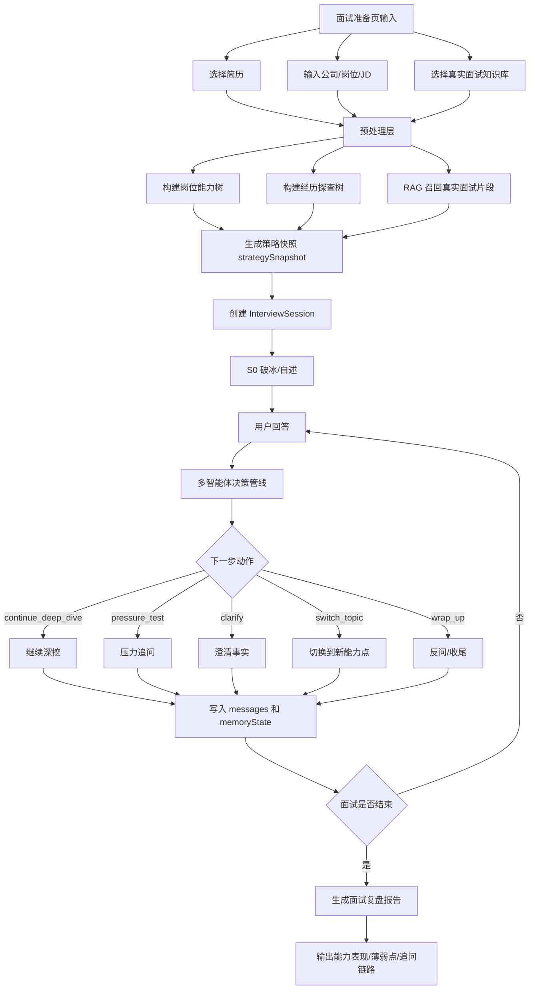
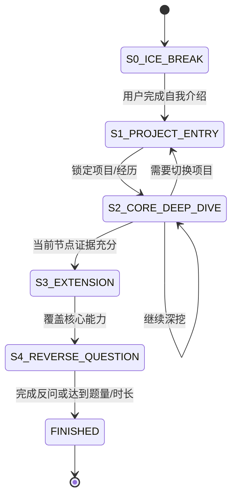
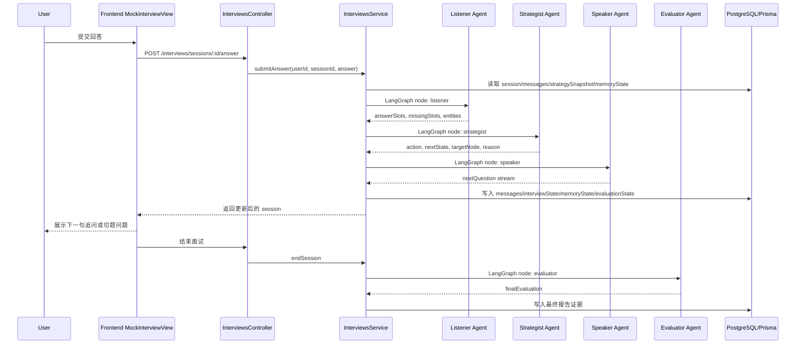
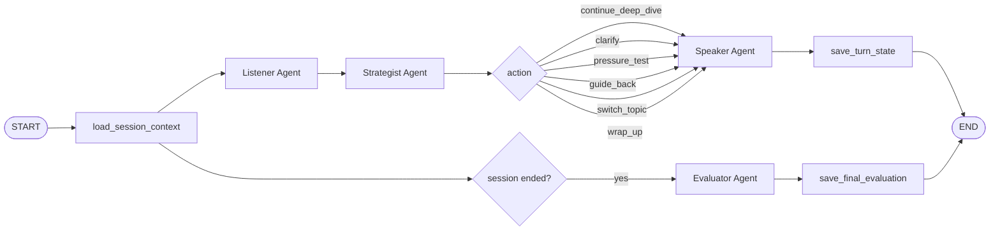

# 专业模拟面试模式落地方案

本文基于 `专业模拟面试模式.md`，将“状态机驱动 + LangGraph 多智能体协同 + 动态深挖”的设想拆成可在当前项目中落地的工程方案。目标不是把模拟面试做成静态题库问答，而是让 AI 面试官能根据候选人的上一轮回答持续判断：继续深挖、切换话题、纠偏、施压，还是进入收尾。

框架建议使用 LangGraph。LangGraph 的定位是低层级 Agent 编排运行时，适合长运行、有状态、可流式输出、可观测、可恢复的人机交互流程。专业模拟面试正好是一个“边听、边想、边说、边记”的状态机任务，因此比手写串行 service 更适合用 LangGraph 显式建模。

## 1. 落地目标

专业模拟面试模式要解决三个问题：

1. 追问要贴着候选人的回答走，而不是从题库里机械抽题。
2. 面试要有节奏控制，避免一直追问一个点，也避免过早跳题。
3. 复盘报告要能解释“为什么这样追问”，而不仅是给最终分数。

当前项目已经具备以下基础能力：

- 创建面试会话时加载简历、JD、知识库，并生成 `questions` 和 `strategySnapshot`。
- 用户提交回答后，后端可以调用 AI 生成追问。
- 面试结束后可生成结构化报告。
- `InterviewSession` 已有 `messages`、`questionFeedback`、`strategySnapshot` 等 JSON 字段，适合继续扩展状态数据。

需要补齐的核心能力：

- 将 `generateFollowUpQuestion` 升级为 LangGraph 驱动的 `InterviewGraphService.runTurn`。
- 在 session 中维护 `interviewState` 和 `memoryState`。
- 使用 LangGraph 将单次追问拆成四个明确节点：Listener Agent、Strategist Agent、Speaker Agent、Evaluator Agent。

四个 Agent 的拆分不是伪需求，而是对抗大模型能力短板的工程解法。通过 LangGraph 的状态机编排，我们将一个复杂的“边听、边想、边说、边记”任务拆解成流水线作业。这不仅提升模拟面试的拟真度，也让系统的可调试性显著增强：可以清楚定位是 Listener 没听懂、Strategist 决策错了、Speaker 表达不自然，还是 Evaluator 最终归因不准确。

## 2. 总体管线



## 3. 状态机设计

专业模式建议采用轻量有限状态机，不需要引入复杂工作流引擎。状态直接保存在 `InterviewSession.interviewState` 中即可。



状态含义：

| 状态 | 作用 | 典型问题 |
| --- | --- | --- |
| `S0_ICE_BREAK` | 破冰和自我介绍 | “请用 1 分钟介绍你和这个岗位最相关的经历。” |
| `S1_PROJECT_ENTRY` | 选择一个项目或实习经历切入 | “你刚才提到数据分析实习，这里面你具体负责哪一块？” |
| `S2_CORE_DEEP_DIVE` | 对技术方案、业务背景、指标、个人贡献深挖 | “SARIMAX 外生变量具体选了哪些？怎么验证有效？” |
| `S3_EXTENSION` | 从项目延展到岗位能力、行业认知、反事实场景 | “如果数据量扩大 10 倍，你会怎么改方案？” |
| `S4_REVERSE_QUESTION` | 候选人反问和求职动机验证 | “你有什么想了解团队或岗位的地方？” |
| `FINISHED` | 结束并触发报告 | 生成复盘报告 |

## 4. LangGraph 多智能体协同管线

专业模拟面试模式使用 LangGraph 编排四个 Agent。这里的多 Agent 不是为了堆概念，而是为了把一个大模型很容易混在一起做错的复杂任务拆成可观察、可替换、可调参的节点。

四个 Agent 固定为：

| Agent | 核心职责 | 不负责什么 |
| --- | --- | --- |
| Listener Agent | 听懂候选人回答，抽取事实、槽位、缺口和风险信号 | 不做决策，不生成面试官话术 |
| Strategist Agent | 根据状态机、JD 能力树、简历探查树下达下一步决策 | 不写最终自然语言问题 |
| Speaker Agent | 把决策转成真实面试官口吻，并支持流式输出 | 不改策略，不打分 |
| Evaluator Agent | 面试结束后基于全程摘要和证据做最终总结评估 | 不在每轮对话中打断候选人 |

LangGraph 在这里承担三件事：

1. 维护统一的 `InterviewGraphState`。
2. 明确节点顺序和条件分支。
3. 保留每个节点的输入、输出和状态补丁，方便调试与回放。



### 4.0 LangGraph 节点图



说明：

- 常规作答轮次只走 Listener -> Strategist -> Speaker。
- Evaluator 不参与每轮追问，避免面试过程变成“边答边点评”。
- 结束面试时再调用 Evaluator 读取结构化摘要、追问链路、关键证据，生成最终评估。

### 4.1 Listener Agent

职责：只理解候选人回答，不负责提问。

输入：

- 当前问题
- 用户最新回答
- 最近 3 轮原始对话
- 历史轮次结构化摘要 `turnSummaries`
- 简历片段、JD 能力标签、当前项目节点

输出建议：

```json
{
  "summary": "候选人说明用 SARIMAX 预测销售量，并引入外生变量改善准确率。",
  "entities": ["SARIMAX", "外生变量", "MAPE", "RMSE"],
  "slots": {
    "background": "商场定价和销量预测",
    "action": "引入外生变量并做时间序列建模",
    "result": "提到精度提升，但缺少具体数值",
    "personalContribution": "不明确"
  },
  "missingSlots": ["外生变量选择依据", "评估指标数值", "个人贡献边界"],
  "riskSignals": ["指标泛化", "贡献不清"]
}
```

### 4.2 Strategist Agent

职责：决定下一步动作，不直接写最终话术。

可选动作：

| action | 含义 | 使用场景 |
| --- | --- | --- |
| `continue_deep_dive` | 继续深挖 | 回答里出现可验证技术点或模糊指标 |
| `clarify` | 澄清事实 | 候选人描述不完整，缺背景/角色/结果 |
| `pressure_test` | 压力测试 | 回答看似完整，需要验证边界、反事实、取舍 |
| `switch_topic` | 切换话题 | 当前节点已充分，或追问次数达到上限 |
| `guide_back` | 拉回主题 | 用户跑偏、绕开 JD 核心要求 |
| `wrap_up` | 收尾 | 核心能力覆盖完成或达到题量/时间 |

输出建议：

```json
{
  "action": "continue_deep_dive",
  "nextState": "S2_CORE_DEEP_DIVE",
  "targetCapability": "建模评估与实验设计",
  "targetResumeNode": "全国大学生数学建模大赛",
  "reason": "候选人提到模型优化，但没有说明外生变量选择和指标提升幅度。",
  "questionIntent": "验证方案是否真实落地，以及候选人是否理解评估指标。",
  "memoryPatch": [
    "候选人使用 SARIMAX 做销量预测",
    "候选人尚未说明 MAPE/RMSE 的具体提升"
  ]
}
```

### 4.3 Speaker Agent

职责：把决策转成自然面试官话术。

话术要求：

- 每次只问一个核心问题。
- 口吻像技术探讨，不像审问。
- 必须引用用户上一轮回答中的关键词。
- 不给评分，不总结优缺点，不提前泄露评估标准。

输出示例：

```json
{
  "messageType": "follow_up",
  "content": "你刚才提到 SARIMAX 引入外生变量后预测效果变好，我想具体问一下：这些外生变量是怎么选出来的？你当时用 MAPE 或 RMSE 看到的提升大概是多少？"
}
```

### 4.4 Evaluator Agent

职责：最后总结评估，不参与每轮追问，不干扰对话。

Evaluator 在 `endSession` 或生成报告时触发，输入来自 LangGraph State 中沉淀的结构化摘要、策略决策记录、简历/JD 能力树和最近必要原文，而不是全量聊天记录。

记录维度：

- 技术深度
- 逻辑自洽
- 岗位匹配
- 证据密度
- 表达结构
- 抗压表现
- 跑题风险

输出写入 `evaluationState`，并交给报告服务使用。

## 5. 推荐数据结构

建议在 `InterviewSession` 增加三个 JSON 字段：

```prisma
model InterviewSession {
  // existing fields...
  interviewState Json?
  memoryState    Json?
  evaluationState Json?
}
```

LangGraph 运行时建议使用一个统一的 `InterviewGraphState`，数据库字段只是持久化后的结果。

```ts
type InterviewGraphState = {
  sessionId: string;
  userId: number;
  stage: 'S0_ICE_BREAK' | 'S1_PROJECT_ENTRY' | 'S2_CORE_DEEP_DIVE' | 'S3_EXTENSION' | 'S4_REVERSE_QUESTION' | 'FINISHED';
  latestAnswer: string;
  recentRawMessages: Array<{ role: 'assistant' | 'user'; content: string }>;
  turnSummaries: Array<{
    turn: number;
    topic: string;
    facts: string[];
    missingSlots: string[];
    riskSignals: string[];
  }>;
  strategySnapshot: unknown;
  memoryState: unknown;
  listenerOutput?: unknown;
  strategistDecision?: unknown;
  speakerOutput?: {
    messageType: 'question' | 'follow_up' | 'pressure_test' | 'topic_switch' | 'closing';
    content: string;
  };
  evaluationState?: unknown;
};
```

关键原则：

- `recentRawMessages` 只保存最近 3 轮原始对话，供 Speaker 保持语言连贯。
- `turnSummaries` 保存 Listener 每轮提取的结构化摘要，供 Strategist 做决策。
- `memoryState` 保存跨轮稳定事实，例如已验证亮点、未验证声称、当前项目节点。
- 不在 LangGraph State 中无限追加全量原始聊天记录，避免第 10 轮以后 Token 和延迟成倍增长。

`interviewState` 示例：

```json
{
  "stage": "S2_CORE_DEEP_DIVE",
  "currentResumeNodeId": "project-math-modeling",
  "currentCapability": "建模评估与实验设计",
  "turnCount": 5,
  "deepDiveCountForCurrentNode": 2,
  "coveredCapabilities": ["自我介绍", "项目背景", "技术方案"],
  "pendingCapabilities": ["量化结果", "个人贡献", "反事实推演"],
  "lastAction": "continue_deep_dive"
}
```

`memoryState` 示例：

```json
{
  "candidateClaims": [
    "使用 SARIMAX 预测商场销量",
    "通过外生变量提升预测准确率"
  ],
  "verifiedEvidence": [
    "能解释项目背景和基本建模流程"
  ],
  "unverifiedClaims": [
    "准确率大幅提升",
    "外生变量选择合理"
  ],
  "resumeNodes": [
    {
      "id": "project-math-modeling",
      "title": "全国大学生数学建模大赛",
      "status": "probing",
      "askedIntents": ["背景", "方案"],
      "missingIntents": ["指标", "贡献边界", "失败复盘"]
    }
  ]
}
```

`evaluationState` 示例：

```json
{
  "dimensionScores": {
    "technicalDepth": 65,
    "logic": 70,
    "jdFit": 60,
    "evidenceDensity": 45,
    "communication": 72
  },
  "turnReviews": [
    {
      "questionId": "q-1",
      "action": "continue_deep_dive",
      "riskSignals": ["缺少指标"],
      "positiveSignals": ["能说明技术路线"]
    }
  ]
}
```

## 6. 后端改造点

### 6.1 依赖与模块组织

后端是 NestJS + TypeScript，建议直接使用 LangGraph.js：

```bash
npm install @langchain/langgraph @langchain/core
```

推荐新增目录：

```text
ai-job-backend/src/interviews/graph/
  interview-graph.state.ts
  interview-graph.service.ts
  nodes/listener.node.ts
  nodes/strategist.node.ts
  nodes/speaker.node.ts
  nodes/evaluator.node.ts
  prompts/listener.prompt.ts
  prompts/strategist.prompt.ts
  prompts/speaker.prompt.ts
  prompts/evaluator.prompt.ts
```

### 6.2 `InterviewGraphService`

新增 LangGraph 编排服务：

```ts
export class InterviewGraphService {
  runTurn(input: RunInterviewTurnInput): Promise<InterviewTurnResult>;
  runFinalEvaluation(input: RunFinalEvaluationInput): Promise<InterviewFinalEvaluation>;
}
```

`runTurn` 执行：

```text
load_session_context
-> listener
-> strategist
-> speaker
-> save_turn_state
```

`runFinalEvaluation` 执行：

```text
load_session_context
-> evaluator
-> save_final_evaluation
```

### 6.3 `InterviewAiService`

`InterviewAiService` 不再承担编排职责，只负责各 Agent 的模型调用：

```ts
runListener(input: ListenerInput): Promise<ListenerOutput>;
runStrategist(input: StrategistInput): Promise<StrategistDecision>;
runSpeaker(input: SpeakerInput): AsyncIterable<SpeakerChunk> | Promise<SpeakerOutput>;
runEvaluator(input: EvaluatorInput): Promise<EvaluatorOutput>;
```

Strategist 建议返回：

```ts
type StrategistDecision = {
  action: 'continue_deep_dive' | 'clarify' | 'pressure_test' | 'switch_topic' | 'guide_back' | 'wrap_up';
  nextState: 'S0_ICE_BREAK' | 'S1_PROJECT_ENTRY' | 'S2_CORE_DEEP_DIVE' | 'S3_EXTENSION' | 'S4_REVERSE_QUESTION' | 'FINISHED';
  messageType: 'question' | 'follow_up' | 'pressure_test' | 'topic_switch' | 'closing';
  reason: string;
  targetCapability: string;
  targetResumeNode?: string;
  speakerInstruction: string;
  memoryPatch: string[];
};
```

Speaker 只接收 `speakerInstruction`、最近 3 轮原文、候选人最新回答和必要背景，输出真实面试口吻。

### 6.4 `InterviewsService.submitAnswer`

当前逻辑：

```text
保存用户回答 -> 生成 followUpMessage -> 保存 messages
```

目标逻辑：

```text
保存用户回答
读取 questions / strategySnapshot / interviewState / memoryState / evaluationState
调用 InterviewGraphService.runTurn
根据 Strategist action 决定是否更新 currentQuestion / ended / stage
写入 assistant message
合并 listenerOutput / strategistDecision / memoryPatch / turnSummaries
保存 session
返回 session
```

### 6.5 `moveToNextQuestion`

专业模式下不建议让前端直接强制进入下一题。可以保留接口，但增加规则：

- 普通模式：沿用当前手动下一题。
- 专业模式：优先由 `InterviewGraphService.runTurn` 中的 Strategist 节点判断是否切题。
- 用户点击“跳过/下一题”时，后端把它视为 `manual_switch_topic` 信号，写入 `interviewState.lastUserControlAction`。

### 6.6 报告生成

报告服务应读取 `evaluationState` 和 `memoryState`，补充以下内容：

- 本轮面试覆盖了哪些 JD 能力。
- 哪些简历亮点被验证了，哪些仍然只是口头声称。
- AI 面试官的追问链路是否合理。
- 候选人在哪些问题上被拉回、跑偏或缺少证据。

## 7. 前端交互落地

### 7.1 面试聊天页

建议显示轻量状态标签，不显示复杂调试信息：

- `项目切入`
- `核心深挖`
- `压力追问`
- `视野拓展`
- `反问环节`

当后端返回 `messageType = pressure_test` 时，可以在气泡上显示“压力追问”小标签，帮助用户理解当前训练强度。

### 7.2 控制按钮

保留用户控制，但减少对流程的破坏：

- “我想跳过”：调用跳过接口，并记录跳过原因。
- “换个方向”：向后端发送 `userControlSignal = switch_topic`。
- “提示我怎么答”：不直接给答案，可以给 STAR 框架提示，避免破坏模拟真实性。

### 7.3 面试结束页

报告中新增“追问链路复盘”：

```text
问题：介绍数学建模项目
追问 1：为什么选择 SARIMAX？
追问 2：外生变量如何选择？
追问 3：MAPE/RMSE 提升多少？
结果：候选人能说明建模流程，但缺少指标和个人贡献边界。
```

## 8. 多 Agent 延迟与上下文优化

多 Agent 协同会天然增加串行调用和 Token 成本。专业模拟面试必须把延迟设计纳入第一版，而不是等上线后再补。

### 8.0 延迟治理的四项硬约束

实现 LangGraph 四 Agent 管线时，必须同时考虑以下四个问题，否则多 Agent 的拟真度提升会被响应延迟抵消：

| 问题 | 必须采用的策略 | 落地方式 |
| --- | --- | --- |
| 串行调用变多 | 合并 Listener 和 Strategist | 标准模式保持两个逻辑节点；低延迟模式使用 `ListenerStrategist` 合并节点，减少一次 LLM 往返 |
| 每个 Agent 都用重模型 | 快慢模型分配 | Listener / Strategist 使用快模型，例如 `deepseekV4-flash`、`GPT-4o-mini` 同级别；Speaker 使用逻辑和表达更强的模型 |
| 用户感知等待变长 | “思考中”状态 + Speaker 流式输出 | Listener / Strategist 阶段展示“思考中”；Speaker 一旦开始生成就 streaming 到前端，降低体感延迟 |
| 多轮上下文 Token 膨胀 | 状态摘要 + 滑动窗口 | Strategist 读取 Listener 生成的 `turnSummaries`，不读全量历史；Speaker 只读最近 3 轮原始对话 + Strategist 决策指令 |

特别注意：LLM 推理时间与输入 Token 数量高度相关。多轮对话到第 10 轮后，如果每次都把完整历史发给“决策大脑”，延迟会成倍增加。因此 LangGraph State 里不要无限保存全量原始对话，应将全量历史压缩成结构化摘要数组。

推荐的摘要形态：

```json
[
  {
    "turn": 1,
    "topic": "项目A",
    "facts": ["用切分解决大模型注意力分散"],
    "missingSlots": ["切分标准", "评估指标"]
  }
]
```

决策 Agent 只读取这个精简摘要数组、当前 Listener 输出和 `memoryState`，目标是让决策阶段 Token 消耗减少 70% 以上。Speaker Agent 为了保持语言连贯，只接收最近 3 轮原始对话和当前 Strategist 的 `speakerInstruction`，不接收全量历史。

### 8.1 合并 Listener 和 Strategist 的降级路径

标准路径：

```text
Listener -> Strategist -> Speaker
```

低延迟路径：

```text
ListenerStrategist -> Speaker
```

当满足以下条件时，可以合并 Listener 和 Strategist，减少一次串行 LLM 调用：

- 用户回答较短。
- 当前阶段不是关键深挖节点。
- 当前轮只是澄清事实或普通切题。
- 系统处于高并发或模型响应变慢状态。

合并节点仍然要输出两个逻辑区块：

```json
{
  "listener": {
    "summary": "候选人说明了项目背景，但缺少指标。",
    "missingSlots": ["量化结果"]
  },
  "strategist": {
    "action": "clarify",
    "speakerInstruction": "追问具体结果指标"
  }
}
```

这样即使物理调用合并，调试视角仍能区分“听懂”和“决策”两个阶段。

### 8.2 快慢模型分配

不同 Agent 使用不同模型，避免所有节点都调用重模型：

| Agent | 推荐模型策略 | 原因 |
| --- | --- | --- |
| Listener Agent | 快模型，例如 `deepseekV4-flash`、`GPT-4o-mini` 同级别 | 主要做抽取、摘要、槽位识别 |
| Strategist Agent | 快模型优先，复杂节点可升级到强模型 | 主要做规则化决策，输出结构化 JSON |
| Speaker Agent | 逻辑与表达更强的模型，并启用流式输出 | 决定用户感知质量，需要真实面试口吻 |
| Evaluator Agent | 强模型，可异步执行 | 面试结束后生成总结，不阻塞实时对话 |

Speaker Agent 要优先支持 streaming。即使总耗时不变，用户看到面试官开始输出的时间会明显提前，体感延迟更低。

### 8.3 交互层缓解延迟感

前端在等待 LangGraph 执行时，应区分两种状态：

- Listener / Strategist 阶段：展示“思考中”。
- Speaker 阶段：进入流式输出，逐字或分句展示面试官问题。

推荐交互：

```text
用户提交回答
-> 气泡显示“面试官正在梳理你的回答...”
-> Speaker 开始 streaming
-> 替换为真实追问内容
```

不要让用户在空白界面等待完整链路结束。

### 8.4 上下文层削减冗余 Token

LLM 推理时间与输入 Token 数量高度相关。多轮对话到第 10 轮时，如果每次都把完整历史发给 Listener、Strategist、Speaker，延迟会成倍增加。

上下文策略：

1. 状态摘要替代全量历史。
   - LangGraph State 中不保存全量原始对话。
   - 每轮由 Listener 产出结构化摘要，例如：

```json
[
  {
    "turn": 1,
    "topic": "项目A",
    "facts": ["用文本切分解决大模型注意力分散"],
    "missingSlots": ["切分标准", "评估指标"]
  }
]
```

2. Strategist 只读取精简摘要数组。
   - 输入：`turnSummaries`、`memoryState`、`strategySnapshot`、当前 Listener 输出。
   - 不读取全量 `messages`。
   - 目标是让决策 Agent 的 Token 消耗减少 70% 以上。

3. Speaker 使用滑动窗口。
   - 输入最近 3 轮原始对话。
   - 再加当前 Strategist 的 `speakerInstruction`。
   - 不传全量历史，避免语言生成阶段被无关上下文拖慢。

4. Evaluator 在结束后读取摘要和必要原文。
   - 默认读取 `turnSummaries`、`strategistDecisionLog`、`memoryState`。
   - 只有需要引用原文证据时，再读取对应轮次的短片段。

## 9. Prompt 设计原则

专业模式 Prompt 必须明确以下约束：

1. 只问一个核心问题，不能连环发问。
2. 必须引用候选人上一轮回答中的关键词。
3. 不要评价“回答得不错”，评价留到报告阶段。
4. 如果候选人回答泛泛，要追问事实、动作、指标。
5. 如果候选人回答完整，要追问取舍、边界、反事实。
6. 如果候选人跑偏，要礼貌拉回当前问题。
7. 如果当前节点已经追问 2 到 3 轮且信息足够，要主动切换话题。

## 10. 分阶段实施计划

### P0：LangGraph 基础接入

- 新增 `interviewState`、`memoryState`、`evaluationState`。
- 新增 `InterviewGraphService`。
- 接入 LangGraph StateGraph。
- 实现 Listener、Strategist、Speaker 三个实时节点。
- 专业模式启用新管线，其他模式保持现状。

### P1：状态机闭环

- 支持 `S0` 到 `S4` 的状态流转。
- 根据 `action` 自动决定追问、切题、收尾。
- 前端展示当前训练阶段。
- Speaker 支持流式输出。

### P2：Evaluator 与报告增强

- 面试结束时触发 Evaluator Agent。
- 报告读取 `evaluationState`。
- 增加“追问链路复盘”和“JD 能力覆盖图”。

### P3：延迟优化与可观测性

- 增加 Listener + Strategist 合并节点的降级路径。
- 按 Agent 配置快慢模型。
- 记录每个 LangGraph node 的输入摘要、输出和耗时。
- 接入 LangSmith 或本地 trace 日志，用于判断问题出在 Listener、Strategist 还是 Speaker。

## 11. 风险与规避

| 风险 | 表现 | 规避方式 |
| --- | --- | --- |
| 追问过多 | 用户卡在一个问题里出不来 | 每个节点限制 2 到 3 轮深挖 |
| 追问太散 | 像随机聊天 | Strategist 必须绑定 `targetCapability` 和 `targetResumeNode` |
| 延迟变高 | 多 Agent 多次调用 | Listener + Strategist 可合并；Speaker 流式输出；快慢模型分配 |
| Token 膨胀 | 第 10 轮后明显变慢 | `turnSummaries` 替代全量历史；Speaker 只读最近 3 轮 |
| 上下文丢失 | 后续追问忘记前文 | 维护 `memoryState`，只注入高价值记忆和当前节点摘要 |
| 评价干扰面试 | 面试中频繁点评用户 | Evaluator 只在结束后总结评估 |
| AI 被用户带偏 | 用户强行转移到优势项目 | `guide_back` 动作拉回 JD 和当前问题 |
| 调试困难 | 不知道哪个 Agent 出错 | LangGraph 记录每个 node 的输入、输出、耗时和状态补丁 |

## 12. 推荐结论

这套专业模式可以使用 LangGraph，而且建议使用。原因是专业模拟面试本质上不是单次问答，而是一个长运行、有状态、强分支、需要调试的 Agent workflow。

```text
LangGraph 状态机 + 四 Agent 明确分工 + 结构化记忆池 + Speaker 流式输出 + Evaluator 结束后总结
```

最终方案坚持四个 Agent 的真实拆分：

- Listener Agent 负责听懂。
- Strategist Agent 负责下达决策。
- Speaker Agent 负责说得像真实面试官。
- Evaluator Agent 负责最后总结评估。

延迟问题通过合并 Listener/Strategist 的降级路径、快慢模型分配、Speaker streaming、状态摘要和滑动窗口共同解决。这样既保留多 Agent 的可调试性，又能控制线上交互体验。

## 13. 参考资料

- LangGraph TypeScript 官方文档：`https://docs.langchain.com/oss/javascript/langgraph/overview`
