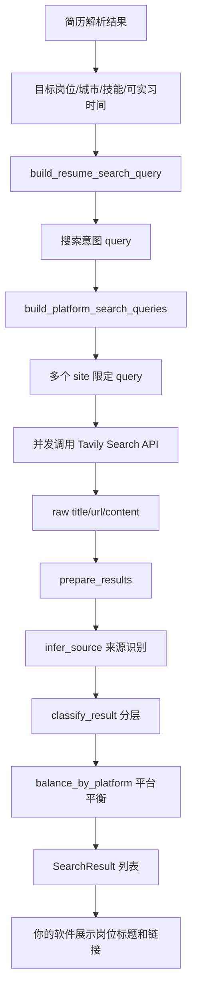

# JobRecommendation：岗位搜索推荐模块

这是从原项目中抽出的“岗位搜索推荐链路”独立模块。它适合嵌入到你自己的软件后端中，用 Tavily 搜索公开招聘网页，并返回结构化岗位结果：

- 岗位标题 `title`
- 岗位链接 `url`
- 来源平台 `source`
- 摘要 `summary`
- 推荐分层 `tier`
- 分层原因 `tier_reason`

## 1. 这个模块解决什么问题

不要直接把完整简历丢给 Tavily 问：

```text
请帮我推荐工作岗位，并给出具体岗位链接，我的简历如下……
```

这种方式容易返回泛泛建议，而不是具体 JD 链接。

本模块做的是：

1. 把目标岗位、城市、技能、可实习时间拼成搜索意图。
2. 自动生成多个带 `site:` 限定的招聘平台搜索 query。
3. 并发调用 Tavily Search API。
4. 清洗 Tavily 返回的网页结果。
5. 根据 URL 判断来源平台。
6. 去重、分层、按平台平衡数量。
7. 返回可直接展示给用户的岗位列表。

## 2. 目录结构

```text
JobRecommendation/
  README.md
  requirements.txt
  .env.example
  job_recommendation/
    __init__.py
    config.py
    schemas.py
    search.py
  examples/
    demo_search.py
```

## 3. 安装依赖

进入该目录：

```powershell
cd D:\Study\rh\zhitouCopilot\ai-career\ai-career-jd-agent\JobRecommendation
pip install -r requirements.txt
```

复制环境变量模板：

```powershell
copy .env.example .env
```

然后在 `.env` 中填写：

```text
TAVILY_API_KEY=你的 Tavily Key
```

## 4. 最小调用示例

```python
from job_recommendation import load_tavily_key, recommend_jobs_from_resume_profile

tavily_api_key = load_tavily_key(".env")

results = recommend_jobs_from_resume_profile(
  tavily_api_key=tavily_api_key,
  target_roles=["数据分析", "商业分析", "数据运营", "数据产品"],
  cities=["北京", "上海", "天津"],
  skills=["Python", "SQL", "Power BI", "Tableau", "机器学习", "A/B测试"],
  availability="可连续实习6个月 每周5天",
  max_results=20,
  source_keys=("campus", "general", "company"),
  mode="fast",
  profile="data",
)

for job in results:
  print(job.title, job.url, job.source, job.tier)
```

也可以直接运行示例：

```powershell
python examples\demo_search.py
```

## 5. 推荐链路图



## 6. 核心 API

### 6.1 `recommend_jobs_from_resume_profile`

适合直接从“简历画像”推荐岗位。

```python
recommend_jobs_from_resume_profile(
  tavily_api_key: str,
  target_roles: list[str],
  cities: list[str],
  skills: list[str] | None = None,
  availability: str = "",
  max_results: int = 30,
  source_keys: list[str] | tuple[str, ...] | None = None,
  mode: str = "fast",
  profile: str = "data",
) -> list[SearchResult]
```

参数说明：

| 参数 | 说明 |
|---|---|
| `tavily_api_key` | Tavily API Key |
| `target_roles` | 目标岗位方向，例如 `["数据分析", "商业分析"]` |
| `cities` | 目标城市，例如 `["北京", "上海"]` |
| `skills` | 简历中的核心技能，例如 `["Python", "SQL", "Power BI"]` |
| `availability` | 可实习时间，例如 `"可连续实习6个月 每周5天"` |
| `max_results` | 最多返回岗位数 |
| `source_keys` | 搜索源，支持 `campus`、`general`、`company` |
| `mode` | `fast` 或 `deep` |
| `profile` | `data` 或 `ai`，决定扩展词和分层关键词 |

### 6.2 `search_public_jobs`

适合你已经有搜索关键词时调用。

```python
from job_recommendation import search_public_jobs

results = search_public_jobs(
  query="数据分析 实习 Python SQL 北京 上海 可实习6个月",
  tavily_api_key=tavily_api_key,
  max_results=30,
  source_keys=("campus", "general", "company"),
  mode="fast",
  profile="data",
)
```

### 6.3 `build_platform_search_queries`

只生成 Tavily query，不真正搜索。适合调试。

```python
from job_recommendation import build_platform_search_queries

queries = build_platform_search_queries(
  query="数据分析 实习 Python SQL 北京 上海",
  source_keys=("campus", "company"),
  mode="fast",
  profile="data",
)

for query, group_name, target_key in queries:
  print(group_name, target_key, query)
```

生成结果类似：

```text
实习僧 shixiseng 数据分析 实习 Python SQL 北京 上海 招聘 岗位职责 任职要求 site:shixiseng.com
牛客 nowcoder 数据分析 实习 Python SQL 北京 上海 招聘 岗位职责 任职要求 site:nowcoder.com
公司官网 company 数据分析 实习 Python SQL 北京 上海 招聘 岗位职责 任职要求 site:jobs.bytedance.com
```

## 7. 返回数据结构

`SearchResult` 定义在 `job_recommendation/schemas.py`：

```python
@dataclass
class SearchResult:
  index: int
  title: str
  url: str
  summary: str
  source: str = "公开网页"
  tier: str = "主投岗"
  tier_reason: str = "与搜索关键词相关，适合作为候选岗位。"
```

如果你的软件需要 JSON，可以这样转换：

```python
from dataclasses import asdict

payload = [asdict(item) for item in results]
```

## 8. 搜索源说明

`source_keys` 支持三组：

| key | 含义 | 站点 |
|---|---|---|
| `campus` | 实习校招平台 | 实习僧、牛客、应届生、智联校园、前程无忧校园、拉勾校招 |
| `general` | 通用招聘平台 | Boss 直聘、智联招聘、前程无忧、猎聘、拉勾 |
| `company` | 公司官网 | 腾讯、字节、阿里、百度、小米、美团、京东、网易、华为、快手 |

建议默认：

```python
source_keys=("campus", "general", "company")
```

如果你只想搜更稳定的公开岗位页，可以先用：

```python
source_keys=("campus", "company")
```

## 9. fast 和 deep 的区别

| 模式 | 特点 |
|---|---|
| `fast` | query 少，速度快，消耗 Tavily 额度少 |
| `deep` | 自动扩展更多岗位词和公司官网域名，覆盖更广，但更慢、更耗额度 |

数据分析方向 `profile="data"` 的 deep 扩展词包括：

```text
数据分析 实习
商业分析 实习
数据运营 实习
数据产品 实习
用户增长 数据分析 实习
BI SQL Python 实习
机器学习 数据分析 实习
金融 数据分析 实习
```

AI 方向 `profile="ai"` 的 deep 扩展词包括：

```text
大模型 实习
LLM 实习
Agent 实习
RAG 实习
AI 应用开发 实习
Prompt 工程 实习
Python AI 实习
大模型应用开发 实习
```

## 10. 如何接入你自己的软件

### 后端接入示例

假设你的后端是 FastAPI：

```python
from dataclasses import asdict
from fastapi import FastAPI
from pydantic import BaseModel
from job_recommendation import recommend_jobs_from_resume_profile

app = FastAPI()

class RecommendPayload(BaseModel):
  target_roles: list[str]
  cities: list[str]
  skills: list[str] = []
  availability: str = ""

@app.post("/api/recommend-jobs")
def recommend_jobs(payload: RecommendPayload):
  results = recommend_jobs_from_resume_profile(
    tavily_api_key="你的 Tavily Key",
    target_roles=payload.target_roles,
    cities=payload.cities,
    skills=payload.skills,
    availability=payload.availability,
    max_results=30,
    profile="data",
  )
  return {"ok": True, "results": [asdict(item) for item in results]}
```

### 前端展示字段

推荐展示：

- `title`
- `source`
- `tier`
- `tier_reason`
- `summary`
- `url`

## 11. 和原项目的关系

本目录抽取自原项目中的岗位搜索链路：

| 原项目文件 | 本模块位置 |
|---|---|
| `src/services/job_search.py` | `job_recommendation/search.py` |
| `src/core/schemas.py` 的 `SearchResult` | `job_recommendation/schemas.py` |
| `src/core/config.py` 的 Tavily Key 读取 | `job_recommendation/config.py` |

本模块不包含：

- 简历 PDF/DOCX 解析
- JD 结构化抽取
- 简历和 JD 匹配分析
- 前端页面
- FastAPI 服务

这些能力可以在你自己的软件里另行实现，然后把“目标岗位、城市、技能、可实习时间”传给本模块。

## 12. 注意事项

1. Tavily 搜索公开网页，不保证每个招聘平台都有稳定可访问的岗位页。
2. Boss 直聘、部分招聘站点可能需要登录，搜索结果可能不稳定。
3. 推荐排序是启发式，不是机器学习排序模型。
4. 当前 `profile="data"` 更适合数据分析、商业分析、数据运营、数据产品方向。
5. 如果用于别的职业方向，建议修改 `DATA_ANALYST_EXPANSIONS` 和 `classify_result()` 中的关键词。

