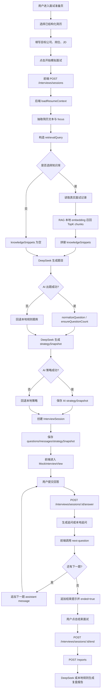
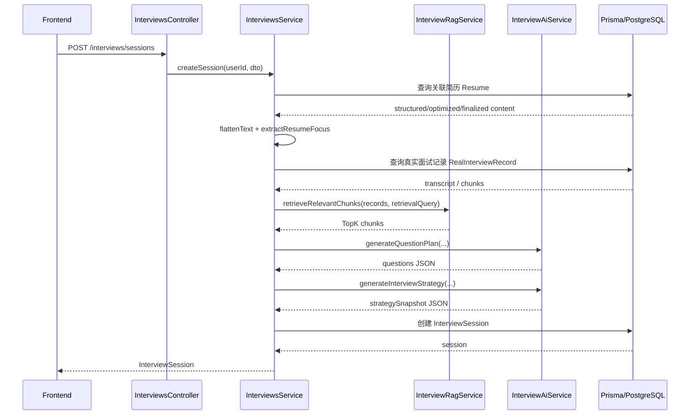
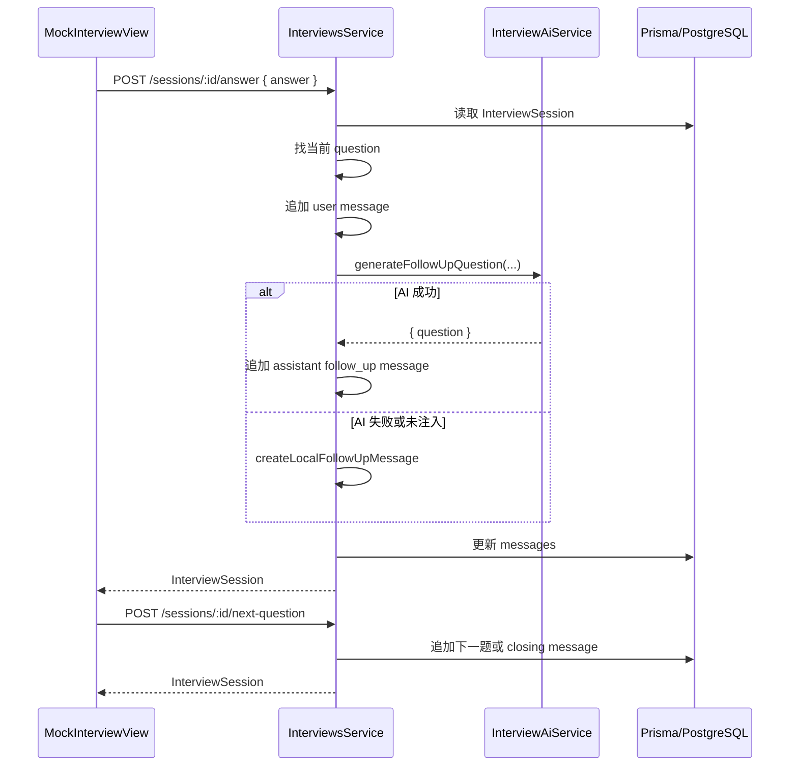
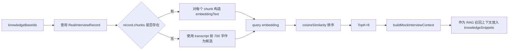
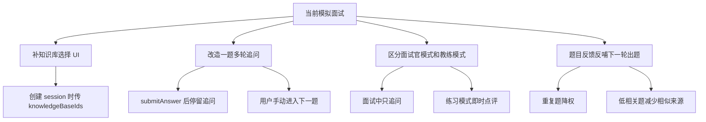

# 模拟面试管线与提示词说明

本文档说明当前「模拟面试」模块从前端创建面试、后端生成题目、AI 追问、结束复盘到数据落库的完整管线，并整理代码中的主要提示词。

## 1. 核心结论

当前模拟面试不是单个 prompt，而是由多组 prompt 串联完成：

- 面试题生成 prompt：创建会话时生成题目列表。
- 面试策略 prompt：基于简历、JD、题目和知识库生成本轮训练策略。
- 追问 prompt：用户每次回答后，生成一个针对性追问。
- 即时反馈 prompt：代码中已实现，但当前主聊天流程没有直接使用。
- 复盘报告 prompt：结束面试后，生成结构化面试复盘报告。
- 知识库构建 prompt：真实面试记录入库时，把转写文本拆成 RAG 可检索材料。

主要代码位置：

```text
frontEnd/src/components/InterviewSetupView.tsx
frontEnd/src/components/MockInterviewView.tsx
frontEnd/src/api/backend.ts
frontEnd/src/App.tsx

ai-job-backend/src/interviews/interviews.controller.ts
ai-job-backend/src/interviews/interviews.service.ts
ai-job-backend/src/interviews/interview-ai.service.ts
ai-job-backend/src/interviews/interview-rag.service.ts
ai-job-backend/src/reports/reports.service.ts
ai-job-backend/prisma/schema.prisma
```

## 2. 总体流程图



## 3. 前端入口

### 3.1 面试准备页

文件：

```text
frontEnd/src/components/InterviewSetupView.tsx
```

用户在该页面完成：

- 选择简历。
- 填写目标公司。
- 填写目标岗位。
- 粘贴 JD。
- 点击「开始模拟面试」。

开始按钮最终调用 `onStartInterview`，实际实现位于：

```text
frontEnd/src/App.tsx
```

前端固定传入：

```ts
{
  interviewType: "professional",
  questionCount: 5,
  resumeId: setupData.resumeId,
  jobDescription: fullJobDescription || undefined,
  knowledgeBaseIds: [],
  enableFollowUp: true,
  enableVoiceInput: true,
  language: "zh-CN",
}
```

注意：当前前端传入的 `knowledgeBaseIds` 是空数组，所以线上默认不会主动带真实面试知识库进入模拟面试，除非后续 UI 加上知识库选择能力。

### 3.2 模拟面试页

文件：

```text
frontEnd/src/components/MockInterviewView.tsx
```

核心交互：

- 展示后端 session 中的 `messages`。
- 展示题目清单 `questionsPreview`。
- 用户输入回答后调用 `submitInterviewAnswer`。
- 随后调用 `nextInterviewQuestion` 推进到下一题。
- 用户点击结束后调用 `endInterviewSession`，再调用 `generateInterviewReport`。

当前提交回答代码逻辑：

```ts
const answered = await backendApi.submitInterviewAnswer(currentSession.sessionId, userText);
const nextSession = answered.ended
  ? answered
  : await backendApi.nextInterviewQuestion(currentSession.sessionId);
syncSessionToChat(nextSession);
```

这意味着后端虽然会在 `submitAnswer` 时生成追问消息，但前端紧接着推进下一题。因此当前 UI 上更像是「回答一题后进入下一题」，而不是停在同一题等待用户继续回答追问。

## 4. 后端接口管线

接口定义：

```text
ai-job-backend/src/interviews/interviews.controller.ts
```

主要接口：

```text
POST /interviews/sessions
GET  /interviews/sessions/active/latest
GET  /interviews/sessions/:sessionId
POST /interviews/sessions/:sessionId/questions
POST /interviews/sessions/:sessionId/questions/:questionId/skip
POST /interviews/sessions/:sessionId/questions/:questionId/feedback
POST /interviews/sessions/:sessionId/answer
POST /interviews/sessions/:sessionId/next-question
POST /interviews/sessions/:sessionId/end
GET  /interviews/sessions/:sessionId/progress
```

### 4.1 创建会话

核心函数：

```text
InterviewsService.createSession
```

执行顺序：



如果 DeepSeek 调用失败，会回退到本地规则：

- `buildQuestionPlan`：本地题库。
- `buildLocalStrategySnapshot`：本地策略。
- 日志会记录类似「DeepSeek 面试题生成失败，已回落到规则题」。

### 4.2 提交回答与追问

核心函数：

```text
InterviewsService.submitAnswer
```

执行顺序：



### 4.3 结束面试与复盘报告

结束面试：

```text
POST /interviews/sessions/:sessionId/end
```

生成报告：

```text
POST /reports
```

报告 prompt 在：

```text
ai-job-backend/src/reports/reports.service.ts
```

结束接口内部也会异步尝试 `ensureReportGenerated`，前端随后又会显式调用一次 `generateInterviewReport`。如果报告已存在，实际行为取决于 `ReportsService.generate` 内部的幂等处理。

## 5. RAG 管线

RAG 服务：

```text
ai-job-backend/src/interviews/interview-rag.service.ts
```

当前 RAG 是本地 hash embedding，不依赖外部 embedding 模型：

```text
generateLocalHashEmbedding
cosineSimilarity
```

召回流程：



RAG prompt 片段结构：

```text
# 模拟面试官任务

你是 AI 求职助手的模拟面试官。请基于用户简历、目标岗位和真实面试知识库召回内容，生成贴近目标岗位的定制化追问。

## 本次模拟目标
...

## 简历摘要
...

## 岗位 JD
...

## RAG 召回片段
...
```

## 6. 主要提示词整理

### 6.1 面试题生成 system prompt

位置：

```text
InterviewAiService.createInterviewSystemPrompt
```

内容要点：

```text
你是一名资深中文技术面试官，正在为 AI 求职助手生成结构化模拟面试题。
请严格返回 JSON object，不要 Markdown，不要解释。
JSON 格式：{"questions":[{"content":"题目文本","dimension":"general|professional|behavioral|stress|english","dimensionLabel":"中文维度名","difficulty":"easy|medium|hard","sourceType":"rule|resume|job_description|knowledge_base","sourceLabel":"中文来源说明"}]}
如果提供 resumeContext，必须优先围绕简历中的项目、技能、工作经历生成问题，sourceType 使用 resume，sourceLabel 使用“基于关联简历”。
题目必须具体、可回答、适合口头面试。若提供知识库素材，优先结合真实面试记录追问。
```

对应 user prompt 是 JSON：

```json
{
  "task": "generate_interview_questions",
  "interviewType": "professional",
  "questionCount": 5,
  "targetDifficulty": "medium",
  "language": "zh-CN",
  "enableFollowUp": true,
  "jobDescription": "...",
  "resumeContext": {
    "title": "...",
    "focus": "...",
    "text": "最多 3000 字"
  },
  "knowledgeSnippets": [
    {
      "title": "...",
      "transcript": "最多 1800 字",
      "structuredContent": {},
      "chunks": []
    }
  ]
}
```

输出会被 `normalizeQuestion` 统一处理为：

```ts
{
  id: "q-1",
  order: 1,
  content: "第 1 题：...",
  dimension: "...",
  dimensionLabel: "...",
  difficulty: "easy|medium|hard",
  difficultyLabel: "简单|中等|困难",
  sourceType: "rule|resume|job_description|knowledge_base",
  sourceLabel: "...",
  skipped: false
}
```

### 6.2 面试策略 system prompt

位置：

```text
InterviewAiService.createInterviewStrategySystemPrompt
```

内容要点：

```text
你是一名求职面试策略教练，不是面试官。
你的任务是根据候选人的简历、目标 JD、真实面试知识库和即将进行的题目，生成本轮模拟面试训练策略。
优势必须有证据，不允许凭空夸；短板必须能映射到岗位要求或面试风险。
引导话术必须自然，不能建议造假，只能建议候选人重组表达顺序。
你要区分有效引导和逃避问题：有效引导必须与当前问题、简历证据或 JD 相关；逃避问题要被面试官拉回。
严格返回 JSON object，不要 Markdown，不要解释。
```

要求返回：

```json
{
  "advantageProfile": [
    {
      "area": "优势方向",
      "evidence": ["证据"],
      "jdRelevance": "与JD关联",
      "confidence": 0.8,
      "interviewerHooks": ["面试官可深挖切口"],
      "candidateSteeringSentences": ["候选人自然引导话术"]
    }
  ],
  "weaknessProfile": [
    {
      "area": "短板方向",
      "risk": "风险",
      "triggerQuestions": ["触发问题"],
      "repairActions": ["修复动作"]
    }
  ],
  "interviewStrategy": {
    "mainGoal": "本轮训练目标",
    "questionMix": {
      "advantageVerification": 30,
      "weaknessExposure": 40,
      "jdFit": 20,
      "pressureTest": 10
    },
    "allowedSteeringRule": "允许引导规则",
    "antiDriftRule": "防跑偏规则"
  }
}
```

这个结果保存到 `InterviewSession.strategySnapshot`，后续追问和复盘报告会使用它。

### 6.3 追问 system prompt

位置：

```text
InterviewAiService.createFollowUpQuestionSystemPrompt
```

内容要点：

```text
你是一名严格但友好的中文 AI 面试官。
当前处于同一道题的多轮追问阶段。你不能给评分，不能总结优缺点，不能说“回答得不错”。
你的任务是基于候选人刚才的回答，继续提出一个有压力、有针对性的追问。
追问应围绕：事实细节、技术取舍、量化结果、个人贡献、失败复盘、边界条件、团队协作。
你可以接受候选人把话题自然引导到自己的优势点，但前提是该优势与当前题目、简历证据或目标 JD 有明确关联。
如果候选人强行转移到无关经历、回避当前问题或绕开 JD 核心要求，你必须礼貌拉回当前问题继续追问。
不要被候选人盲目带偏；最终仍要验证岗位匹配度、能力真实性和表达可信度。
如果回答很泛，要追问具体背景、行动和结果；如果回答较完整，要追问指标、权衡或反事实。
严格返回 JSON object，不要 Markdown，不要解释。
JSON 格式：{"question":"面试官下一句追问，40-120字"}
```

对应 user prompt 包含：

```json
{
  "task": "generate_interview_follow_up_question",
  "rule": "Do not evaluate the answer. Ask only one follow-up question as the interviewer.",
  "currentQuestion": {
    "content": "...",
    "dimension": "...",
    "difficulty": "...",
    "sourceType": "..."
  },
  "latestAnswer": "...",
  "jobDescription": "...",
  "recentMessages": "最近 8 条消息",
  "strategySnapshot": {
    "advantageProfile": "最多 4 条",
    "weaknessProfile": "最多 4 条",
    "allowedSteeringRule": "...",
    "antiDriftRule": "..."
  }
}
```

AI 失败时本地追问规则：

```text
回答少于 80 字：
追问背景、负责范围、结果证明。

回答不少于 80 字：
追问量化指标、数据对比、贡献证明。
```

### 6.4 即时反馈 system prompt

位置：

```text
InterviewAiService.createAnswerFeedbackSystemPrompt
```

内容要点：

```text
你是一名严格但友好的 AI 面试官。
用户刚回答了一道模拟面试题，你需要给出即时反馈，并判断是否需要追问。
请严格返回 JSON object，不要 Markdown，不要解释。
JSON 格式：{"feedback":"给候选人的简短中文反馈，80-180字","strengths":["优点"],"improvements":["改进点"],"followUp":"可选追问，若不需要则为空字符串","score":1-10}
反馈要具体，指出回答里缺少的 STAR/项目指标/技术细节，不要空泛鼓励。
```

注意：`InterviewsService.createAnswerFeedbackMessage` 已实现，但当前 `submitAnswer` 实际调用的是 `createFollowUpQuestionMessage`，不是 `createAnswerFeedbackMessage`。也就是说当前主流程更偏「追问型面试官」，不是「每题即时点评型教练」。

### 6.5 复盘报告 system prompt

位置：

```text
ReportsService.createReportSystemPrompt
```

内容要点：

```text
你是一名资深中文面试复盘教练，正在为 AI 求职助手生成结构化面试复盘报告。
注意：面试过程中 AI 只负责追问，所有评分、正确/错误分析、改进建议都必须在本报告中完成。
请逐题分析候选人的每次回答质量，尤其关注：是否正面回答、事实是否具体、逻辑是否清晰、是否有量化结果、技术细节是否可信、个人贡献是否明确。
每道题必须包含 correctPoints、wrongPoints、diagnosis、improvement、referenceAnswer、knowledgeTags 和 qaTranscript。knowledgeTags 后续会作为知识库标签。
wrongPoints 不是羞辱用户，而是指出回答中的缺失、风险、模糊、逻辑漏洞或下次需要修正的地方。
请额外总结候选人的优势打法、短板修复路线，以及候选人是否成功把面试官自然引导到自己的强项。
有效引导必须与当前题目、简历证据或目标 JD 有关；如果候选人只是逃避问题，请在 failedSteering 中指出。
严格返回 JSON object，不要 Markdown，不要解释。
```

对应 user prompt 包含：

```json
{
  "task": "generate_mock_interview_review_report",
  "interviewType": "...",
  "totalQuestions": 5,
  "answeredQuestions": 3,
  "strategySnapshot": {},
  "questionThreads": [
    {
      "id": "q-1",
      "question": "...",
      "dimension": "...",
      "difficulty": "...",
      "answers": ["..."],
      "followUps": ["..."],
      "transcript": []
    }
  ]
}
```

AI 失败时会走 `buildLocalReport`，用回答数量、字数、结构词、数字指标等规则生成本地报告。

### 6.6 知识库构建 system prompt

位置：

```text
InterviewAiService.createKnowledgeBuildSystemPrompt
```

内容要点：

```text
你是一名面试复盘知识库工程师，需要把真实面试记录结构化为后续 RAG 可检索素材。
请严格返回 JSON object，不要 Markdown，不要解释。
JSON 格式：{"summary":"总结","tags":["标签"],"focusAreas":["高频方向"],"questions":[{"question":"面试题","answer":"候选人回答或要点","dimension":"能力维度","difficulty":"easy|medium|hard","keywords":["关键词"]}],"weakPoints":["薄弱点"],"followUpSuggestions":["后续训练建议"],"chunks":[{"id":"chunk-1","title":"片段标题","content":"可独立检索的完整片段","keywords":["关键词"],"sourceType":"question|answer|summary|weak_point"}]}
chunks 必须短而完整，每个 120-400 字，适合后续 embedding。
```

该 prompt 不在创建模拟面试时直接触发，而是在真实面试复盘材料构建知识库时使用。生成的 `chunks` 会被模拟面试 RAG 召回使用。

## 7. 数据库存储

模型位置：

```text
ai-job-backend/prisma/schema.prisma
```

### 7.1 InterviewSession

```prisma
model InterviewSession {
  id               String
  type             String
  totalQuestions   Int
  currentQuestion  Int
  ended            Boolean
  jobDescription   String?
  knowledgeBaseIds Json?
  questions        Json?
  questionFeedback Json?
  strategySnapshot Json?
  messages         Json
  userId           Int
  resumeId         Int?
  startedAt        DateTime
  endedAt          DateTime?
  updatedAt        DateTime
}
```

关键字段：

- `questions`：题目预览列表。
- `messages`：面试聊天记录，包括 assistant question、assistant follow_up、user answer、closing。
- `strategySnapshot`：本轮面试策略。
- `questionFeedback`：用户对题目的难度、相关性、重复度反馈。
- `currentQuestion`：当前题号。
- `ended` / `endedAt`：面试结束状态。

### 7.2 RealInterviewRecord

保存真实面试复盘材料：

- `transcript`
- `structuredContent`
- `chunks`
- `status`
- `buildStatus`

这些字段会进入模拟面试 RAG 召回。

### 7.3 ReviewReport

保存最终复盘报告：

- `score`
- `level`
- `summary`
- `dimensions`
- `questions`
- `nextActions`
- `topDirections`
- `advantageSummary`
- `weaknessSummary`
- `interviewerSteeringReview`

## 8. DeepSeek 调用参数

位置：

```text
InterviewAiService.chatJson
ReportsService.generateAiReport
```

配置项：

```text
DEEPSEEK_BASE_URL 默认 https://api.deepseek.com
DEEPSEEK_MODEL 默认 deepseek-v4-pro
DEEPSEEK_TIMEOUT_MS 默认 60000
DEEPSEEK_API_KEY 必填
```

请求参数：

```json
{
  "model": "deepseek-v4-pro",
  "messages": [
    { "role": "system", "content": "..." },
    { "role": "user", "content": "..." }
  ],
  "response_format": { "type": "json_object" },
  "temperature": 0.2
}
```

## 9. 当前实现中的注意点

### 9.1 前端默认不传知识库

`App.tsx` 中创建模拟面试时：

```ts
knowledgeBaseIds: []
```

所以虽然后端 RAG 管线已经存在，但当前默认模拟面试不会使用用户真实面试知识库。

### 9.2 追问 prompt 已生成，但 UI 会马上进入下一题

`submitAnswer` 会生成追问消息；但前端 `handleSend` 会紧接着调用 `nextInterviewQuestion`。

结果是：

```text
回答当前题 -> 后端追加追问 -> 前端立刻要求下一题 -> 聊天显示可能直接进入下一题
```

如果产品目标是「一题多轮追问」，建议调整前端：

- 第一次回答后只调用 `submitInterviewAnswer`。
- 展示追问，等待用户继续回答。
- 用户点击「下一题」时才调用 `nextInterviewQuestion`。

### 9.3 即时反馈 prompt 当前未接入主流程

`createAnswerFeedbackMessage` 已经实现，但没有在 `submitAnswer` 主链路中调用。

当前设计更像：

```text
面试中只问问题和追问 -> 结束后统一复盘评分
```

如果需要「每题答完立即评分」，可以把 `createAnswerFeedbackMessage` 接入 `submitAnswer` 或新增单独接口。

### 9.4 本地规则回退比较完整

如果 AI 服务不可用，仍可完成：

- 本地规则出题。
- 本地策略生成。
- 本地追问。
- 本地复盘报告。

这保证了模拟面试功能不会因为 DeepSeek 故障完全不可用。

## 10. 建议的后续优化



推荐优先级：

1. 先修正追问交互，让「多轮追问」真正停留在当前题。
2. 增加知识库选择入口，让 RAG 管线真实参与模拟面试。
3. 把「面试官模式」和「教练模式」拆开：面试官模式不评分，教练模式每题即时反馈。
4. 将题目反馈写入下一次题目生成 prompt，减少重复题和低相关题。
